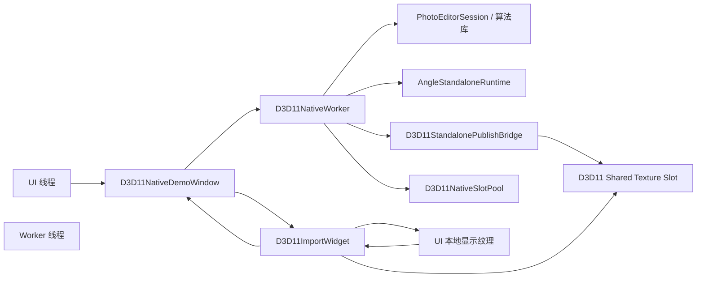
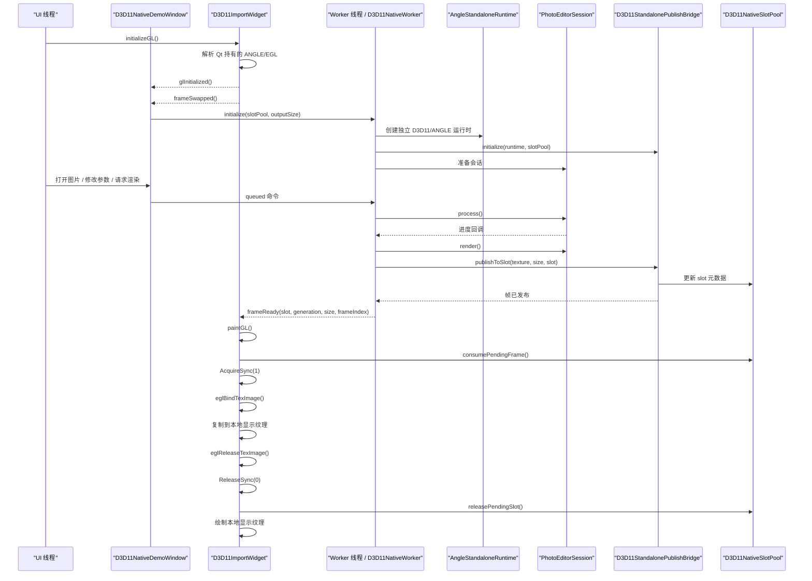

# Gles2AsyncRender Architecture

## 1. 概述

`Gles2AsyncRender` 是一个面向 Windows 的 Qt 5.15.1 图像处理 demo，当前只保留一条主链路：

- UI 线程持有 `QOpenGLWidget`
- worker 线程持有独立的 standalone ANGLE 运行时
- worker 将结果渲染到 D3D11 shared texture
- UI 通过 ANGLE/EGL 导入这些 shared texture，并显示其本地副本

这不是共享 `QOpenGLContext` 的设计。当前架构刻意把显示职责和生产职责分开，让 UI 只负责展示，让 worker 只负责产出。

## 2. 设计目标

- 保持 UI 在 GPU 工作期间仍然流畅响应。
- 避免 UI 和 worker 争用同一条 ANGLE/D3D11 执行路径。
- 为未来真实 GPU 算法库预留清晰边界。
- 通过 slot pool 明确帧交接，而不是隐式复用纹理。
- 通过复制到 UI 本地显示纹理来降低 resize 抖动。

## 3. 总体结构

## 4. 模块职责

### `src/main.cpp`

- 设置 `Qt::AA_UseOpenGLES` 和 `Qt::AA_ShareOpenGLContexts`
- 将默认 surface format 固定为 OpenGLES 2.0
- 创建 `D3D11NativeDemoWindow`

### `src/d3d11_native_demo_window.*`

- 持有主窗口 UI
- 持有 worker `QThread`
- 在显示 widget 发出 `frameSwapped()` 后再启动 worker
- 将菜单、切图和参数变化转发给 worker
- 接收 worker 的状态和错误

### `src/d3d11_import_widget.*`

- 持有 `QOpenGLWidget` 显示面
- 解析 Qt 当前使用的 ANGLE/EGL 入口
- 导入 pending shared texture
- 把导入帧复制到本地 UI 纹理
- 常规绘制时只画本地 UI 纹理

### `src/d3d11_native_worker.*`

- 持有 worker 侧状态机
- 创建和管理 standalone ANGLE 运行时
- 初始化算法宿主和发布桥
- 加载图片目录并切换当前图片
- 异步运行处理并把完成帧发布到 slot pool

### `src/d3d11_native_slot_pool.h`

- 只保存每个 slot 的元数据
- 跟踪 `Free`、`Rendering`、`Pending` 状态
- 防止 worker 在 UI 释放前覆盖 slot
- 防止 UI 在发布完成前消费 slot

### `src/angle_standalone_runtime.*`

- 创建独立的 D3D11 device 和 ANGLE EGL/GLES 上下文
- 从 Qt 已加载的 ANGLE 模块中解析 EGL/GLES 入口
- 对外暴露运行时身份信息，便于诊断

### `src/d3d11_standalone_publish_bridge.*`

- 将 worker 生成的 GL texture 发布到 D3D11 shared texture slot
- 使用 keyed mutex 保护发布过程
- 优先走 GPU publish
- 必要时退回 CPU upload

### `src/photo_editor_*`

- 定义算法库对接 API
- 提供当前的 GLES2 simulator 实现
- 封装源图上传、输出目标创建、异步处理和最终渲染

### `src/qt_angle_egl_tools.*`

- 解析 Qt 持有的 ANGLE EGL 模块
- 提取当前 display 对应的 `EGLDisplay`、`EGLConfig` 和渲染器身份
- 为导入桥提供和 Qt 一致的运行时

### `src/angle_threading.*`

- 探测 Qt 当前使用的 ANGLE 运行时
- 在 backend 为 ANGLE/D3D11 时启用 `ID3D11Multithread`

### `src/runtime_diagnostics.*`

- 统一处理 info / warning / diagnostic 日志
- 只有在设置 `GLES2ASYNC_DIAG` 时才输出详细诊断日志

## 5. 运行时边界

当前有两套独立的 GPU 执行环境：

1. UI 运行时
   - 由 Qt 和 `QOpenGLWidget` 持有
   - 仅用于显示侧导入和合成

2. Worker 运行时
   - 由 `AngleStandaloneRuntime` 持有
   - 用于算法执行和纹理发布

这两套运行时不会共享同一个 GL context。它们唯一共享的是 D3D11 shared texture handle 以及围绕 handle 的 slot 元数据。

## 6. Slot 模型

`D3D11NativeSlotPool` 是核心同步原语。

### Slot 状态

- `Free`
  - worker 可以在这个 slot 上渲染
- `Rendering`
  - slot 当前归 worker 持有，正在写入
- `Pending`
  - worker 已发布，等待 UI 消费

### 规则

- 同一时刻只允许一个 pending 帧。
- worker 必须先拿到 `Free` slot 才能渲染。
- UI 只消费当前 pending 的 slot。
- UI 在把帧复制到本地纹理后，立即释放该 slot。

这样 shared texture 的生命周期就很短，不会让 UI 和 worker 在多个显示周期里长期绑在同一个 slot 上。

## 7. 帧管线

当前帧流程如下：

1. UI 初始化 `QOpenGLWidget`
2. UI 解析 Qt 当前持有的 ANGLE/EGL 运行时
3. UI 在第一次 swap 后发出 `displayReadyForWorker()`
4. Worker 初始化自己的 standalone ANGLE 运行时
5. Worker 初始化算法宿主和发布桥
6. Worker 加载图片目录或切换当前图片
7. Worker 异步运行算法会话
8. Worker 将结果渲染到一张 GL texture
9. 发布桥把结果写入一个 D3D11 shared texture slot
10. Worker 将该 slot 提交为 `Pending`
11. UI 在 `paintGL()` 中消费 pending slot
12. UI 把 shared texture 复制到自己的本地显示纹理
13. UI 将 slot 归还为 `Free`
14. UI 只绘制本地显示纹理

## 8. 渲染时序

## 9. 初始化顺序

启动顺序很重要：

1. `main.cpp` 先设置全局 Qt/GL 属性。
2. `D3D11NativeDemoWindow` 创建显示 widget 和 worker 对象。
3. `D3D11ImportWidget::initializeGL()` 解析当前 Qt ANGLE 运行时。
4. 第一次 `frameSwapped()` 说明显示侧已经足够稳定。
5. 只有到这一步，窗口才会初始化 worker 运行时。

这个顺序是为了避免早期启动阶段的 `makeCurrent()` 竞态。

## 10. 为什么 UI 要先复制再显示

UI 不直接长期持有 shared slot。

它会先把导入的帧复制到本地显示纹理，原因是：

- 缩短带锁 shared slot 的持有时间
- 让显示时机和发布时机解耦
- 提高 resize 稳定性
- 避免 worker 和 UI 抢同一张正在显示的图

## 11. 算法接入约定

未来的真实 GPU 算法库应该直接接在 `photo_editor_*` API 后面，而不改变外层架构。

需要满足的契约：

- 在 worker 运行时上初始化一次
- 接收源图输入
- 接收效果参数
- 异步处理
- 渲染出最终 GL texture
- 将 texture 交给发布桥

外层的 worker / display / 同步设计应该保持不变。

## 12. 运行约束

- 不要让 worker 和 UI 共享同一个 GL context 作为主架构。
- 不要绕过 slot pool。
- UI 复制完成后，不要继续保持 slot 为 `Pending`。
- 不要把 GPU 工作搬回 UI 线程。
- 不要给 worker 重新加载一份和 Qt 不一致的 EGL/ANGLE 运行时。

## 13. 相关文件

- `src/main.cpp`
- `src/d3d11_native_demo_window.cpp`
- `src/d3d11_import_widget.cpp`
- `src/d3d11_native_worker.cpp`
- `src/d3d11_native_slot_pool.h`
- `src/angle_standalone_runtime.cpp`
- `src/d3d11_standalone_publish_bridge.cpp`
- `src/photo_editor_gles2_simulator.cpp`
- `src/qt_angle_egl_tools.cpp`
- `src/angle_threading.cpp`
- `docs/FAILURE_ANALYSIS.md`

