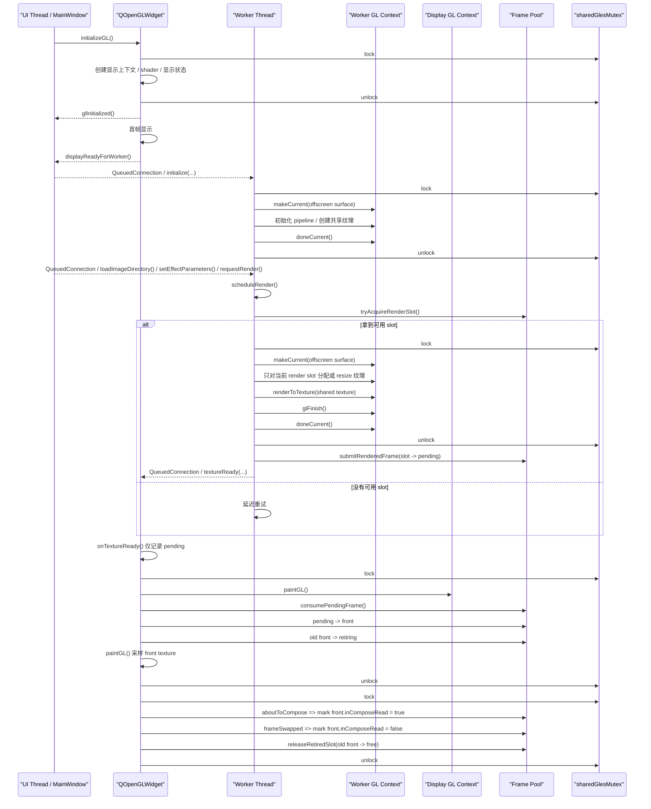

# Gles2AsyncRender

这是一个基于 Qt 5.15.2 的 GLES2 异步图像处理验证工程，当前目标不是做最小 OpenGL 示例，而是验证一条更接近真实产品形态的链路：

- UI 线程使用 `QOpenGLWidget` 只负责显示
- worker 以 `QObject + moveToThread` 的方式运行在独立线程
- worker 线程持有共享的 `QOpenGLContext + QOffscreenSurface`
- 所有依赖 GPU / OpenGL 上下文的重计算都在 worker 上下文内完成
- worker 最终提交共享纹理 id，UI 线程直接消费并显示

当前工程主要面向 Windows + ANGLE + OpenGL ES 2.0 场景，同时也整理了后续扩展到 macOS / Linux 时需要遵守的接入边界。

## 当前 Demo 能力

当前 demo 已经包含一套可直接运行的图像处理验证界面：

- 主窗口负责菜单、状态栏和图像效果控制面板
- 支持导入图片目录并浏览多张图片
- worker 线程内执行亮度、对比度、缩放、平移、旋转、水平翻转、垂直翻转
- 处理结果输出到共享纹理，再由 `QOpenGLWidget` 显示
- 图片在输出纹理中按宽高比显示，不再强制拉伸铺满整个 widget

当前内置处理链仍然只是 demo 后端，但它已经满足未来真实 GPU 算法库的接入方式约束。

## 启动属性

程序启动时会启用：

- `Qt::AA_UseOpenGLES`
- `Qt::AA_ShareOpenGLContexts`

默认格式固定为：

- `OpenGLES 2.0`
- `NoProfile`
- `DoubleBuffer`
- `RGBA8`

## 当前架构

当前代码的职责拆分如下：

- `src/main_window.*`
  - 提供主窗口 UI
  - 创建并管理 worker 线程
  - 在显示侧首帧 `frameSwapped()` 之后启动 worker 初始化
  - 响应“打开目录 / 切图 / 调参 / 请求重绘”

- `src/async_gles_widget.*`
  - 只负责显示共享纹理
  - 持有 `front / pending / retiring` 显示提交状态
  - 在 `paintGL()` 中提升 `pending`，在 `frameSwapped()` 后回收旧 `front`

- `src/shared_gl_environment.*`
  - 从显示上下文派生共享环境
  - 创建 worker 使用的共享 `QOpenGLContext`
  - 为 worker 准备 `QOffscreenSurface`

- `src/shared_gl_context_handle.*`
  - 封装 worker 侧共享上下文和离屏 surface
  - 提供 `makeCurrent()` / `doneCurrent()` 生命周期

- `src/shared_texture_worker.*`
  - 作为 worker object 被移动到 `QThread`
  - 在 worker 上下文内初始化处理管线
  - 为共享纹理槽位创建并注册纹理
  - 接收目录加载、切图、参数变化和重绘请求

- `src/image_processing_pipeline.*`
  - 负责目录扫描和源图上传
  - 负责 shader / FBO / VBO 初始化
  - 负责把图像效果渲染到共享输出纹理
  - 当前输出几何已经收敛为 aspect-fit，而不是 full-stretch

- `src/shared_texture_frame_pool.h`
  - 管理共享纹理槽位状态
  - 约束 `free / rendering / pending / front / retiring` 的流转
  - 管理 per-slot `GLsync` 和 compose 生命周期元数据

## 渲染流程

当前渲染链路如下：

1. `AsyncGlesWidget` 初始化显示上下文，并把共享环境信息交给 `SharedGlEnvironment`
2. 等显示侧首帧 `frameSwapped()` 发生后，再创建 worker 共享上下文并初始化 worker
3. 用户导入图片目录后，worker 在自己的 GL 上下文里加载首张图片并上传源纹理
4. worker 获取可用 render slot，只对当前 slot 做共享纹理分配或 resize
5. `ImageProcessingPipeline` 把处理结果渲染到该 slot 对应的共享纹理
6. worker 将新帧提交为 `pending`
7. widget 在自己的显示时机把 `pending` 提升为 `front`
8. 旧 `front` 等到一次真实 `frameSwapped()` 后才回收

这条路径的重点是：

- UI 线程不参与 GPU 重计算
- worker 不直接改写当前正在显示的 front texture
- resize 时不会批量重分配所有共享纹理

需要明确的是：当前工程在 `Qt 5.15.1 + ANGLE + GLES2 + QOpenGLWidget` 这条运行时路径上，已经回退到“稳定优先”的兼容模式。

- 异步的部分仍然只有：线程职责拆分、请求投递、worker 产出、显示侧切换
- 真正依赖 GLES/ANGLE 的执行路径重新回到全局串行化，避免两个共享上下文并发触发 ANGLE 内部状态机断言
- `front / pending / retiring` slot 生命周期仍然保留，用于避免 worker 直接覆盖当前显示纹理
- 当前实现不是“真正的异步共享纹理渲染模型”，而是“异步调度 + 共享纹理显示 + 全局 GL 串行化”的兼容实现

### 真实时序图

下面这张图反映的是当前代码真实执行的时序：



### 如何解读这张图

- `QueuedConnection` 说明 UI 线程不会同步阻塞等待 worker 立即完成，这一层是异步的
- `pending -> front -> retiring -> free` 说明显示提交和纹理复用是解耦的，worker 不会直接覆盖当前正在显示的纹理
- `sharedGlesMutex` 表示当前环境下真正的 GLES/ANGLE 执行仍是串行的
- `aboutToCompose/frameSwapped` 现在既表达 `front` 的 compose 生命周期，也参与显示侧的稳定串行边界
- 因此当前工程更准确的描述应是“异步调度 / 共享纹理显示 / 全局 GL 串行化模型”
- 它不是“无锁双上下文并行渲染模型”

## Windows / ANGLE 重点说明

在 Qt 5.15 的 Windows 环境下，启用 `AA_UseOpenGLES` 通常意味着走 ANGLE，底层常见实现是 D3D11。

这个组合在多线程共享 GLES 上下文时，决定稳定性的关键点不是表面上的 OpenGL API，而是底层 D3D11 immediate context 的线程保护是否真正启用。

当前工程在运行时会尝试：

- 查询 Qt 当前上下文对应的 ANGLE `EGLDisplay`
- 从 Qt 实际加载的 `libEGL[d].dll` 中解析 EGL 入口
- 解析 `EGL_D3D11_DEVICE_ANGLE`
- 启用 `ID3D11Multithread::SetMultithreadProtected(TRUE)`

当前已经验证过的稳定约束是：

- 必须使用 Qt 实际加载的那一份 `libEGL[d].dll`
- 不能把 Qt 创建出来的 `EGLDisplay` 交给另一份 EGL 模块实例去调用
- worker 不能在 `QOpenGLWidget::initializeGL()` 期间过早 `makeCurrent()`
- 不能把 `QOpenGLWidget` 显示上下文和 worker 共享上下文真正放开并发，否则可能触发 ANGLE 内部 `StateManager11` 断言
- 因此当前代码在这条运行时路径上保留全局 GL 串行化，以换取稳定启动、导图、渲染、resize 和退出

## 真实 GPU 算法库接入建议

未来真实算法库的接入位置应优先放在：

- `src/shared_texture_worker.cpp`
- `src/image_processing_pipeline.cpp`

建议保持外围结构不变，只替换 worker 内部的算法执行部分：

1. 在 worker 共享上下文 current 的情况下做一次性全局初始化
2. 在同一个 worker 上下文里执行逐帧 GPU 处理
3. 返回最终输出纹理 id，或直接写入当前 render slot 对应的共享纹理

不要把 GPU 重计算挪回 UI 线程，也不要改成 CPU 回读再上传的路径。

同时必须保证：

- 算法库不要再额外加载另一套 `libEGL` / `libGLESv2`
- 算法库如果自己解析 EGL / GLES 符号，目标必须是 Qt 当前实际使用的运行时
- 算法库不要绕开当前的共享上下文和提交协议

## 构建方式

当前约定的构建环境：

- Qt: `D:\Qt\5.15.2\msvc2019_64`
- VS 环境脚本: `D:\Program Files\Microsoft Visual Studio\18\Community\VC\Auxiliary\Build\vcvars64.bat`
- 构建目录: `build\msvc64-build`

可使用下面的命令构建：

```powershell
@'
call "D:\Program Files\Microsoft Visual Studio\18\Community\VC\Auxiliary\Build\vcvars64.bat"
cd /d D:\Desktop\Projects\OpenGL\Gles2AsyncRender\build\msvc64-build
"D:\Qt\5.15.2\msvc2019_64\bin\qmake.exe" ..\..\Gles2AsyncRender.pro
nmake
'@ | cmd
```

生成的可执行文件通常位于：

```text
build\msvc64-build\release\Gles2AsyncRender.exe
```

如果使用 debug 配置，也可能输出到：

```text
build\msvc64-build\debug\Gles2AsyncRender.exe
```

## 相关文档

- `docs/FAILURE_ANALYSIS.md`
  - 记录 Windows + ANGLE + `QOpenGLWidget` + worker 共享上下文这一路径上的故障时间线、根因分析与修复策略

- `docs/CROSS_PLATFORM_INTEGRATION.md`
  - 记录 Windows / macOS / Linux 三平台统一接入约束

- `docs/QOPENGLWIDGET_VS_QOPENGLWINDOW.md`
  - 记录 `QOpenGLWidget` 与 `QOpenGLWindow` 在当前问题域下的差异和取舍
