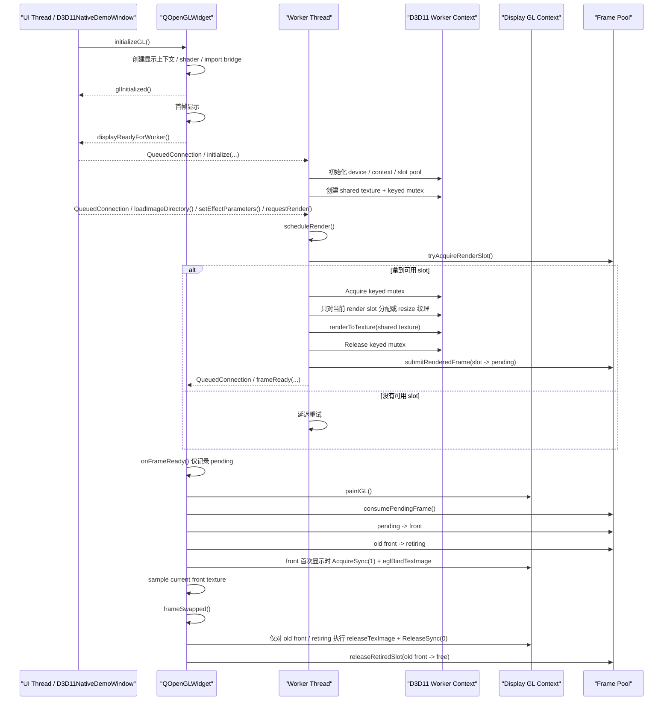

# Gles2AsyncRender

这是一个面向 `Qt 5.15.1 + ANGLE + OpenGLES 2.0 + QOpenGLWidget` 的图像处理工程。当前代码已经收敛到单一主方案：生产者使用 D3D11 原生 shared texture，消费者使用 ANGLE/QOpenGLWidget 导入并显示这块纹理。

- UI 线程仍然使用 `QOpenGLWidget`，但只负责显示
- worker 以 `QObject + moveToThread` 的方式运行在独立线程
- worker 不再持有 `QOpenGLContext` 作为主渲染路径
- worker 直接用 D3D11 写入 shared texture
- UI 侧通过 ANGLE/EGL import bridge 读取并显示 shared texture

当前工程主要面向 Windows，代码中已经只保留这条 D3D11 native shared texture 主路径。

## 当前 Demo 能力

当前程序已经包含一套可直接运行的图像处理界面：

- 主窗口负责菜单、状态栏和图像效果控制面板
- 支持导入图片目录并浏览多张图片
- worker 线程内执行亮度、对比度、缩放、平移、旋转、水平翻转、垂直翻转
- 处理结果输出到 D3D11 shared texture，再由 `QOpenGLWidget` 显示
- 图片在输出纹理中按宽高比显示，不再强制拉伸铺满整个 widget
- 调试运行消息统一输出到日志；状态栏只保留当前图片索引、总数、文件名和原图尺寸

当前内置处理链仍然只是示例后端，但外围同步、显示和线程模型已经按最终主方案收口。

## 当前默认入口

当前程序现在只有一个主入口：`D3D11NativeDemoWindow`

- 无参启动：D3D11 native producer + ANGLE/QOpenGLWidget consumer

配套脚本 `scripts/run-gles2asyncrender.ps1` 现在只保留：

- `-Mode app`

## 启动属性

程序启动时会启用：

- `Qt::AA_UseOpenGLES`
- `Qt::AA_ShareOpenGLContexts`

默认格式固定为：

- `OpenGLES 2.0`
- `NoProfile`
- `DoubleBuffer`
- `RGBA8`

## 当前默认架构

当前代码的职责拆分如下：

- `src/d3d11_native_demo_window.*`
  - 当前默认主窗口入口
  - 提供菜单、精简状态栏和参数控制面板
  - 创建并管理 D3D11 worker 线程
  - 响应“打开目录 / 切图 / 调参 / 请求重绘”

- `src/d3d11_import_widget.*`
  - 当前默认显示侧 widget
  - 只负责把 D3D11 shared texture 导入 ANGLE/EGL，并在 `paintGL()` 中显示
  - 持有 `front / pending / retiring` 显示提交状态
  - 在 `paintGL()` 中提升 `pending`，当前 `front` 保持读侧 keyed mutex；只有旧 `front` 在 `frameSwapped()` 后才回收

- `src/d3d11_native_slot_pool.h`
  - 管理 `free / rendering / pending / front / retiring` 的 slot 生命周期
  - 保证 UI 不会读取正在写入的 slot，worker 也不会覆盖当前 front

- `src/d3d11_native_worker.*`
  - 当前默认生产者
  - 独占 D3D11 device / immediate context
  - 创建 shared texture + keyed mutex
  - 接收目录加载、切图、参数变化和重绘请求
  - 把处理结果写入 slot 对应的 shared texture

## 当前渲染流程

当前渲染链路如下：

1. `D3D11ImportWidget` 初始化显示侧 OpenGL ES / ANGLE 上下文
2. 等显示侧首帧准备完成后，再初始化 `D3D11NativeWorker`
3. worker 创建 D3D11 device / context、slot pool、shared texture 和 keyed mutex
4. 用户导入图片目录后，worker 加载首张图片并上传 D3D11 源纹理
5. worker 获取可用 render slot，并把处理结果写入当前 slot 对应的 shared texture
6. worker 将新帧提交为 `pending`
7. widget 在自己的显示时机把 `pending` 提升为 `front`，并在该 slot 首次成为 `front` 时导入共享纹理
8. 旧 `front` 等到一次真实 `frameSwapped()` 后才释放读锁并回收

这条路径的重点是：

- UI 线程不参与 GPU 重计算
- worker 不直接改写当前正在显示的 front texture
- worker 不再通过共享 `QOpenGLContext` 与 UI 抢占同一条 ANGLE/GLES 执行路径
- 显示侧不会在每次 `frameSwapped()` 对当前 `front` 执行阻塞释放
- resize 时不会批量重分配所有共享纹理

需要明确的是：当前默认实现已经不是“两个 GLES 共享上下文 + 全局 GL 互斥锁”的模型，而是“D3D11 producer + ANGLE/QOpenGLWidget consumer + slot 生命周期保护”的模型。

### D3D11 Native 时序图

下面这张图反映的是当前代码真实执行的时序：



### 如何解读这张图

- `QueuedConnection` 说明 UI 线程不会同步阻塞等待 worker 立即完成，这一层是异步的
- `pending -> front -> retiring -> free` 说明显示提交和纹理复用是解耦的，worker 不会直接覆盖当前正在显示的纹理
- D3D11 keyed mutex 负责 producer/consumer 的资源交接
- 当前 `front` 的读锁会跨多次 `paintGL()/frameSwapped()` 保持，直到它真的退役
- `frameSwapped()` 现在只负责释放旧 `front / retiring`，不再每帧阻塞释放当前显示槽位
- 因此当前默认工程更准确的描述应是“D3D11 producer / shared texture slot pool / ANGLE consumer 模型”
- 旧的共享 GL worker 路径和阶段验证 harness 已经从主工程代码中移除

## Windows / ANGLE 重点说明

在 Qt 5.15 的 Windows 环境下，启用 `AA_UseOpenGLES` 通常意味着走 ANGLE，底层常见实现是 D3D11。

这个组合在多线程共享 GLES 上下文时，决定稳定性的关键点不是表面上的 OpenGL API，而是底层 D3D11 immediate context 的线程保护是否真正启用。

当前默认工程在运行时会尝试：

- 查询 Qt 当前上下文对应的 ANGLE `EGLDisplay`
- 从 Qt 实际加载的 `libEGL[d].dll` 中解析 EGL 入口
- 解析 `EGL_D3D11_DEVICE_ANGLE`
- 启用 `ID3D11Multithread::SetMultithreadProtected(TRUE)`

当前已经验证过的稳定约束是：

- 必须使用 Qt 实际加载的那一份 `libEGL[d].dll`
- 不能把 Qt 创建出来的 `EGLDisplay` 交给另一份 EGL 模块实例去调用
- `QOpenGLWidget` 侧只负责导入和显示，不再承担 worker-side GLES 并发渲染
- 这条路径已经经过 shared texture、ANGLE import bridge、真实目录导图和主入口收口验证

## 真实 GPU 算法库接入建议

未来真实 GPU 算法库的接入位置应优先放在：

- `src/d3d11_native_worker.cpp`

建议保持外围结构不变，只替换 worker 内部的算法执行部分：

1. 在 worker 的 D3D11 device/context 上做一次性全局初始化
2. 在同一个 D3D11 worker 上执行逐帧 GPU 处理
3. 直接写入当前 render slot 对应的 shared texture

不要把 GPU 重计算挪回 UI 线程，也不要改成 CPU 回读再上传的路径。

同时必须保证：

- 算法库不要把主渲染路径重新拉回共享 `QOpenGLContext`
- 如果算法库仍需接触 EGL / GLES，只能接触 Qt 当前实际使用的运行时
- 算法库不要绕开当前的 slot 生命周期和 shared texture 提交协议

## 运行方式

推荐优先使用脚本：

```powershell
powershell -ExecutionPolicy Bypass -File D:\Desktop\AI-Agent\Gles2AsyncRender\scripts\run-gles2asyncrender.ps1 -Mode app
```

常用模式：

- 默认主入口：`-Mode app`

## 构建方式

当前约定的构建环境：

- Qt: `D:\CodePrograms\Qt\5.15.1\msvc2019_64`
- VS 环境脚本: `D:\CodePrograms\Microsoft Visual Studio\2022\Community\VC\Auxiliary\Build\vcvars64.bat`
- 推荐构建目录: `build\qt5151-debug`

可使用下面的命令构建：

```powershell
powershell -ExecutionPolicy Bypass -File D:\Desktop\AI-Agent\Gles2AsyncRender\scripts\run-gles2asyncrender.ps1 -Mode app -Build
```

生成的可执行文件通常位于：

```text
build\qt5151-debug\debug\Gles2AsyncRender.exe
```

## 相关文档

- `docs/FAILURE_ANALYSIS.md`
  - 记录从旧的 worker 共享上下文试验路径收敛到当前 D3D11 native 主方案的故障时间线、根因分析与修复策略

- `docs/CROSS_PLATFORM_INTEGRATION.md`
  - 记录 Windows / macOS / Linux 三平台统一接入约束

- `docs/D3D11_NATIVE_SHARED_TEXTURE_PLAN.md`
  - 记录当前主方案的设计要点、运行约束和后续改进方向

- `docs/QOPENGLWIDGET_VS_QOPENGLWINDOW.md`
  - 记录 `QOpenGLWidget` 与 `QOpenGLWindow` 在当前问题域下的差异和取舍
