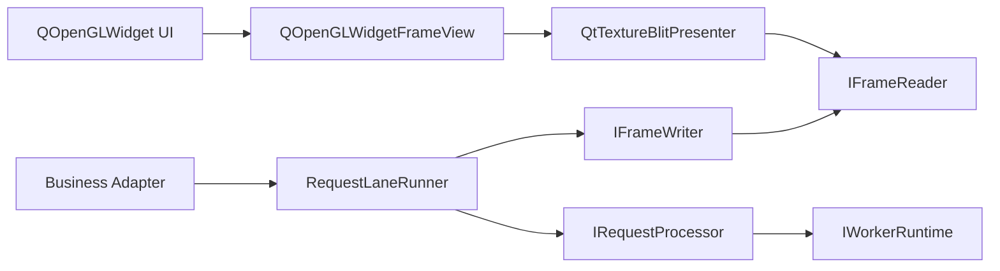

# 跨平台异步渲染框架设计方案

> 历史文档 / 非当前正式架构说明
>
> 当前框架的正式文档只包括：
>
> - [README.md](/D:/Desktop/AI-Agent/Gles2AsyncRender/README.md)
> - [ARCHITECTURE.md](/D:/Desktop/AI-Agent/Gles2AsyncRender/ARCHITECTURE.md)
>
> 本文档保留为历史方案和跨平台设计背景材料。若本文内容与当前代码、`README.md`、`ARCHITECTURE.md` 不一致，一律以当前代码、`README.md`、`ARCHITECTURE.md` 为准。

> 日期：2026-05-15
>
> 状态：Proposed
>
> 本文档将当前 Windows 已验证实现、未来 macOS 接入方案，以及框架重构方向整理为一份完整设计。后续重构应优先以本文档为主参考。
>
> 补充说明：
>
> - 本文档保留了较多“重构前总体设计”表述，适合作为架构思路文档阅读
> - 当前代码已经进一步收敛为 `framework/platform + framework/execution + app` 三层结构
> - 当前实现状态请优先参考：
>   - [ARCHITECTURE.md](/D:/Desktop/AI-Agent/Gles2AsyncRender/ARCHITECTURE.md)
>   - [README.md](/D:/Desktop/AI-Agent/Gles2AsyncRender/README.md)
>
> 因此，本文中关于 `framework/core`、`framework/qt`、`FrameTicket`、`SerialConflatedLane` 等章节，应理解为“上一轮总体方案讨论”，不等同于当前代码的最终目录与命名。
>
> 当前代码与本文若干设计假设已经存在以下差异：
>
> - GPU 预览主路径已经不是 “latest-only + 单 pending”
> - `AsyncLane` 当前主配置为 `MergeWhileBusy + DeliverEveryStartedResult`
> - waiting 区会先保留多个 checkpoint，再对队尾请求做 merge
> - Windows 共享纹理槽当前维护多 `Ready` 队列，而不是单 pending 槽
> - `TextureTicket` 当前额外携带 `outputRevision`，用于隔离 resize 前后的结果
> - 当前平台发布合同已经是 `submitTexture() + drainPendingPublishes() + pendingPublishState()`
> - 当前 publish capacity 事件来自平台 reader release，而不是 widget 信号
> - 当前 `RuntimeHost` 的 Qt 默认实现已经收敛为 `src/framework/execution/qt_runtime_host.*`

## 1. 背景

当前仓库已经验证了一条可工作的 Windows 主链路：

- UI 侧使用 `QOpenGLWidget`
- worker 侧持有独立 ANGLE runtime
- worker 侧通过 D3D11 shared texture 发布输出帧
- UI 侧导入已发布纹理，并复制到本地显示纹理

这条链路本身已经成立，但当前抽象仍然存在明显耦合：

- 耦合当前 photo editor 业务流程
- 耦合当前 Windows backend 实现
- 耦合当前 latest-only 调度方式
- 耦合当前“进度回调式”处理模型

下一阶段设计必须同时满足以下约束：

- 支持平台为 Windows 和 macOS
- 显示侧固定使用 `QOpenGLWidget`
- Windows 保持当前 `GLES2 + ANGLE + D3D11 shared texture` 方案
- macOS 使用 `QOpenGLContext`，其 native backend 为 `NSOpenGLContext`
- macOS 下 worker 和 UI 各自拥有一个独立 `QOpenGLContext`
- macOS 下通过 `QOpenGLContext::setShareContext()` 并在 `create()` 前建立共享关系
- 共享纹理槽仍然是跨线程安全读写的基础机制
- 业务适配层不能以当前图像处理流程为前提设计
- 进度回调只是可选能力，不是框架前提
- 请求可能同步完成
- 请求可能依赖 GPU runtime，也可能只是普通 CPU 函数调用

## 2. 目标

- 将框架职责与业务职责彻底分离。
- 用一套执行模型同时覆盖同步和异步 processor。
- 同时支持依赖 GPU runtime 的 processor 和纯 CPU processor。
- 平台相关的帧传输细节全部下沉到 backend 模块。
- `QOpenGLWidget` 集成逻辑只保留在 Qt 层。
- 把“不可取消的异步请求”作为一等调度前提来建模。
- 避免 backend 内部实现类继续泄漏到 app 和 adapter 层。

## 3. 非目标

- 第一阶段不要求支持 Linux。
- 本设计不讨论 Vulkan、Metal、Direct3D 原生展示路径。
- 第一阶段不要求多 worker 并行执行。
- 第一阶段不要求通用插件动态加载或自动 schema 发现。

## 4. 总体架构

整体拆成四层：

1. `framework/core`
   - 请求模型
   - lane 调度策略
   - processor 生命周期
   - 结果交付模型

2. `framework/platform`
   - worker runtime
   - 帧槽交换
   - 平台相关同步细节

3. `framework/qt`
   - `QOpenGLWidget` 宿主
   - 帧展示逻辑
   - UI 侧复制到本地显示纹理

4. `adapters/*`
   - 业务 payload
   - 业务 processor
   - 可选的业务 coalescer

应用层只负责装配这些组件，不负责解释平台细节。

## 5. 稳定边界

### 5.1 `framework/core` 不应知道

- `QOpenGLWidget`
- `QOpenGLContext`
- `NSOpenGLContext`
- `EGLDisplay`
- `ID3D11Texture2D`
- `IDXGIKeyedMutex`
- `PhotoEditor*` 类型

### 5.2 `framework/platform` 不应知道

- 图片目录选择
- photo editor 参数结构
- view-model 状态
- 除 core 所给合同外的业务合并语义

### 5.3 `framework/qt` 不应知道

- photo editor session
- Windows shared handle 所有权
- macOS native context 初始化细节
- 业务 payload 类型

### 5.4 `adapters/*` 不应知道

- D3D11 shared texture 内部实现
- Qt 侧 frame import 细节
- `QOpenGLWidget` 的绘制生命周期
- lane 调度器内部状态机

## 6. Core 设计

### 6.1 请求模型

请求用强类型 envelope 加业务 payload 表示，替代当前 `shared_ptr<void>` 方式。

```cpp
using RequestId = quint64;
using RequestVersion = quint64;
using LaneId = QString;
using MergeKey = QString;

enum class RequestPriority
{
    Low,
    Normal,
    High
};

enum class ResultDeliveryPolicy
{
    AlwaysDeliver,
    DeliverOnlyIfLatest,
    DeliverOnlyIfNoPending
};

class IRequestPayload
{
public:
    virtual ~IRequestPayload() = default;
};

struct RequestHints final
{
    RequestPriority priority = RequestPriority::Normal;
    ResultDeliveryPolicy deliveryPolicy = ResultDeliveryPolicy::DeliverOnlyIfLatest;
};

struct RequestEnvelope final
{
    RequestId requestId = 0;
    RequestVersion version = 0;
    LaneId laneId;
    MergeKey mergeKey;
    QString requestKind;
    RequestHints hints;
    std::shared_ptr<IRequestPayload> payload;
};
```

规则如下：

- `LaneId` 定义串行执行域。
- `MergeKey` 定义两个请求是否允许合并。
- `requestKind` 只用于诊断和分类，不作为合并身份。
- payload 的具体类型由 adapter 层定义。

### 6.2 结果模型

框架必须支持多种结果形态，而不是默认“结果一定是纹理帧”。

```cpp
struct FrameTicket final
{
    int slotIndex = -1;
    quint64 generation = 0;
    quint64 frameIndex = 0;
    QSize size;
};

struct GpuTextureResult final
{
    GLuint textureId = 0U;
    QSize size;
    QMap<QString, QVariant> metadata;
};

struct CpuImageResult final
{
    QImage image;
    QMap<QString, QVariant> metadata;
};

class ICustomResult
{
public:
    virtual ~ICustomResult() = default;
};

using ProcessorOutputPayload = std::variant<GpuTextureResult,
                                            CpuImageResult,
                                            std::shared_ptr<ICustomResult>>;

struct ProcessorOutput final
{
    RequestId requestId = 0;
    QString outputKind;
    ProcessorOutputPayload payload;
};

using JobResultPayload = std::variant<FrameTicket,
                                      CpuImageResult,
                                      std::shared_ptr<ICustomResult>>;

struct JobResult final
{
    RequestId requestId = 0;
    QString resultKind;
    JobResultPayload payload;
};
```

这里的语义必须区分清楚：

- `ProcessorOutput` 是 processor 直接产出的结果。
- `GpuTextureResult` 是 worker 侧中间 GPU 结果，不是最终 UI 对外交付协议。
- `FrameTicket` 是平台帧交换之后对外暴露的标准结果。
- CPU-only processor 可以直接产出 `CpuImageResult`。
- 业务自定义输出可以通过 `ICustomResult` 传递。
- `JobResult` 才是 lane runner 最终向外交付的结果。

### 6.3 事件模型

进度、消息、状态变化都应该是可选事件，不能作为框架前提。

```cpp
enum class RequestState
{
    Queued,
    Running,
    Completed,
    Cancelled,
    Failed
};

enum class FailureClass
{
    RequestLocal,
    LaneRecoverable,
    RuntimeFatal
};

class IRequestListener
{
public:
    virtual ~IRequestListener() = default;

    virtual void onStateChanged(RequestId requestId, RequestState state) = 0;
    virtual void onProgress(RequestId requestId, int progress, bool isFinal) = 0;
    virtual void onMessage(RequestId requestId, const QString &message) = 0;
    virtual void onResultReady(const JobResult &result) = 0;
    virtual void onFailure(RequestId requestId, FailureClass cls, const QString &error) = 0;
};
```

规则如下：

- processor 可以完全不发进度。
- 同步 processor 可能只发 `Running -> Completed`。
- 异步 processor 可以发任意数量的进度和消息。

## 7. 执行模型

### 7.1 Processor 合同

processor 接口必须同时覆盖：

- 同步 CPU 调用
- 同步 GPU 调用
- 不可取消的异步调用
- 需要 runtime 的 processor
- 不需要 runtime 的 processor

```cpp
enum class RuntimeKind
{
    None,
    AngleGles2,
    SharedDesktopOpenGL
};

struct ProcessorRequirements final
{
    RuntimeKind runtimeKind = RuntimeKind::None;
    bool producesGpuTexture = false;
};

enum class StartDisposition
{
    CompletedInline,
    StartedAsync,
    Failed
};

class IRuntimeContext
{
public:
    virtual ~IRuntimeContext() = default;
    virtual RuntimeKind kind() const = 0;
};

class IExecutionContext
{
public:
    virtual ~IExecutionContext() = default;
    virtual IRuntimeContext *runtime() const = 0;
};

class IRequestExecution
{
public:
    virtual ~IRequestExecution() = default;
    virtual bool isFinished() const = 0;
    virtual bool tryCollect(ProcessorOutput *result, FailureClass *failureClass, QString *error) = 0;
};

class IRequestProcessor
{
public:
    virtual ~IRequestProcessor() = default;

    virtual ProcessorRequirements requirements() const = 0;

    virtual StartDisposition start(const RequestEnvelope &request,
                                   IExecutionContext &context,
                                   IRequestListener *listener,
                                   std::unique_ptr<IRequestExecution> *asyncExecution,
                                   ProcessorOutput *inlineResult,
                                   QString *error) = 0;
};
```

规则如下：

- 同步 processor 返回 `CompletedInline`。
- 异步 processor 返回 `StartedAsync`。
- 第一阶段不要求 processor 暴露 `cancel()` 合同。
- 第一阶段默认 active 异步请求不可取消。

### 7.2 为什么第一阶段不要求取消

当前把“active 请求不可取消”当作保守前提是合理的，因为：

- Windows 当前主路径包含 GPU 工作，半途打断的正确性代价高。
- 未来 macOS 共享纹理槽路径同样涉及跨线程 GPU 资源，不适合默认中断。
- 很多业务库只能提供完成回调，不能提供安全 abort。

这并不排斥未来支持可选取消，只是取消不能作为当前框架正确性的前提条件。

## 8. 请求策略设计

### 8.1 基本调度单元：Lane

调度按 lane 进行。

一个 lane 代表一条串行执行流，具备：

- 最多一个 active 请求
- 策略定义的 waiting 区域
- 一个 processor 实例或 processor 家族
- 一个 runtime 绑定

### 8.2 默认策略：`SerialConflatedLane`

交互式渲染的默认策略定义为：

- 任何时刻最多一个 active 请求
- 任何时刻最多一个 pending 请求
- active 请求不取消
- active 运行期间到来的新请求先合并到 pending
- active 完成或失败后，再把 pending 提升为新的 active

这套策略命名为 `SerialConflatedLane`。

### 8.3 Lane 状态

```cpp
struct LaneSnapshot final
{
    bool hasActive = false;
    bool hasPending = false;
    RequestEnvelope active;
    RequestEnvelope pending;
};
```

统一的公开状态可以收敛为：

- `Idle`
- `Running(active)`
- `Running(active) + Pending(merged)`
- `Suspended`，用于 runtime-fatal 场景

### 8.4 合并策略

请求是否能合并、如何合并，不应写死在 scheduler 里，而应由独立 coalescer 决定。

```cpp
enum class MergeDisposition
{
    KeepExistingPending,
    ReplacePending,
    MergeIntoPending,
    RejectMerge
};

class IRequestCoalescer
{
public:
    virtual ~IRequestCoalescer() = default;

    virtual bool canCoalesce(const RequestEnvelope &older,
                             const RequestEnvelope &newer) const = 0;

    virtual MergeDisposition merge(const RequestEnvelope &olderPending,
                                   const RequestEnvelope &newerIncoming,
                                   RequestEnvelope *mergedPending,
                                   QString *error) const = 0;
};
```

默认实现建议为：

- `ReplaceWithLatestCoalescer`

其他可扩展实现包括：

- `DeduplicateCoalescer`
- `SemanticMergeCoalescer`

### 8.5 结果交付策略

“请求执行结束”与“结果是否交付”必须拆开。

对一个已完成请求，允许三种交付策略：

- `AlwaysDeliver`
  - 即使已经存在更新的 pending 请求，也交付当前结果

- `DeliverOnlyIfLatest`
  - 只有当前仍然是该 lane 上最新请求时才交付

- `DeliverOnlyIfNoPending`
  - 只有 lane 当前没有替代性 pending 请求时才交付

推荐默认值：

- 交互预览类：`DeliverOnlyIfLatest`
- 导出、保存、分析类：`AlwaysDeliver`

### 8.6 失败处理

active 请求失败时，需要区分失败等级：

- `RequestLocal`
  - 当前请求失败
  - lane 可以继续跑 pending

- `LaneRecoverable`
  - 当前 lane 内部状态需要重建
  - 重建后再继续 pending

- `RuntimeFatal`
  - runtime 或平台资源整体不可用
  - lane 进入 `Suspended`
  - 不自动继续 pending
  - 必须等待 runtime/platform bundle 恢复

第一阶段可以保守处理为：

- `RuntimeFatal` 时直接丢弃 pending
- 如后续需要“恢复后继续”，必须显式设计，不能靠隐式重试

### 8.7 其他策略

除 `SerialConflatedLane` 外，后续还应预留这些策略扩展点：

- `SerialFifoLane`
  - 每个请求都必须执行

- `DropWhileBusyLane`
  - busy 时直接丢弃新请求

- `BatchMergeLane`
  - waiting 区域不是 latest 替换，而是聚合 merge

但第一阶段只需要实现 `SerialConflatedLane`。

## 9. 平台层设计

### 9.1 统一平台合同

Windows 和 macOS 对上层都暴露同一组接口：

```cpp
class IWorkerRuntime
{
public:
    virtual ~IWorkerRuntime() = default;
    virtual RuntimeKind kind() const = 0;
    virtual bool initialize(QString *error) = 0;
    virtual bool enter(QString *error) = 0;
    virtual void leave() = 0;
    virtual void shutdown() = 0;
};

struct FrameReadLease final
{
    GLuint textureId = 0U;
    QSize size;
};

class IFrameWriter
{
public:
    virtual ~IFrameWriter() = default;
    virtual bool publishTexture(GLuint sourceTextureId,
                                const QSize &size,
                                FrameTicket *ticket,
                                QString *error) = 0;
    virtual void reset() = 0;
};

class IFrameReader
{
public:
    virtual ~IFrameReader() = default;
    virtual bool acquire(const FrameTicket &ticket, FrameReadLease *lease, QString *error) = 0;
    virtual void release(const FrameReadLease &lease) = 0;
};
```

上面这组 `IFrameWriter / IFrameReader` 接口是历史抽象草案，不代表当前代码。

当前实现的对应关系是：

- 历史 `IFrameWriter` 大致对应当前 `framework/platform/IWriter`
- 但当前 `IWriter` 已经不是单个 `publishTexture(...) -> bool` 合同
- 当前代码采用：
  - `submitTexture(...) -> PublishResult`
  - `drainPendingPublishes() -> PublishDrainResult`
  - `pendingPublishState() -> PendingPublishState`
- 当前 publish capacity 也不是由 Qt presenter 直接驱动，而是由 reader release 后的 platform event 触发

其中：

- Qt presenter 只需要 `IFrameReader`
- processor 只能通过 `IExecutionContext` 间接访问 runtime
- app 层只需要拿到平台 bundle，不需要知道具体 backend 类型

### 9.2 统一槽状态

跨平台帧交换统一使用如下槽生命周期：

- `Free`
- `Writing`
- `Ready`
- `Reading`
- `Free`

公开设计层不再继续沿用平台私有命名如 `Pending`。

统一规则：

- worker 只能写入 `Free`
- UI 只能读取 `Ready`
- `Reading` 状态期间禁止覆盖同一槽
- 槽元数据至少包含 `slotIndex`、`generation`、`frameIndex`、`size`

## 10. Windows 后端方案

### 10.1 Runtime

Windows runtime 保持当前做法：

- `Qt::AA_UseOpenGLES`
- 独立 ANGLE worker runtime
- worker runtime 内部持有 D3D11 device
- GLES2 函数表由 worker runtime 自己解析

建议对应实现：

- `AngleStandaloneRuntime` 实现 `IWorkerRuntime`

### 10.2 Frame Exchange

Windows 帧交换保留：

- D3D11 shared texture slot
- backend 内部 shared handle
- UI 侧 ANGLE EGL import
- keyed mutex 同步

建议对应实现：

- `WinD3D11TextureExchangeWriter` 实现 `IFrameWriter`
- `WinD3D11TextureExchangeReader` 实现 `IFrameReader`

当前已有 slot pool 和 publish 代码可以复用，但要做两点收敛：

- shared handle 不能再上浮为公开协议
- `FrameTicket` 替代当前公开的 `transportMetadata`

### 10.3 UI 消费方式

UI 获取 `FrameTicket` 后：

1. 向 `IFrameReader` 申请 lease
2. 读取 backend 提供的纹理
3. 复制到 UI 本地显示纹理
4. 释放 lease

这样可以保留当前 Windows 路径的优点：

- shared slot 持有时间短
- 显示与 backend 同步解耦
- resize 稳定性高

## 11. macOS 后端方案

### 11.1 Runtime

macOS runtime 使用：

- UI 侧 `QOpenGLWidget`
- worker 侧独立 `QOpenGLContext`
- 在 `create()` 之前通过 `QOpenGLContext::setShareContext(uiContext)` 建立共享关系
- native backend 为 `NSOpenGLContext`

建议对应实现：

- `MacSharedOpenGLRuntime` 实现 `IWorkerRuntime`

这里需要明确：

- Qt API 叫 `setShareContext()`
- 设计文档和代码都不应发明 `setShared()` 这类不存在的 API 名称

### 11.2 Frame Exchange

macOS 不使用 D3D11 shared handle，而是使用同一 share group 中的共享 OpenGL 对象。

建议实现为：

- exchange 内部维护固定数量的共享纹理槽
- 每个槽内部持有可供 worker 写入的纹理和 FBO
- worker 把 processor 输出复制进槽纹理
- UI 在自己的共享 context 中读取同一槽纹理

建议对应实现：

- `MacSharedTextureExchangeWriter` 实现 `IFrameWriter`
- `MacSharedTextureExchangeReader` 实现 `IFrameReader`

### 11.3 同步方式

最低安全规则：

- worker 只有在槽纹理写入完成后，才能把槽从 `Writing` 变成 `Ready`
- UI 只有在槽为 `Ready` 时才能读取
- UI 在复制到本地显示纹理后，必须释放该槽

同步细节建议：

- 优先使用 `GLsync` 或等价桌面 OpenGL 同步能力
- 保守回退方案为 `glFlush()` 配合严格槽所有权规则

回退方案之所以可接受，是因为：

- 每个 lane 只有一个 worker producer
- 每个 widget 只有一个 UI consumer
- `Ready/Reading` 状态下的槽不会被覆盖

与 Windows 一样，presenter 仍然先复制到本地显示纹理，再做最终绘制。这样可以让 UI 层合同在两平台上保持一致。

## 12. Qt 展示层设计

### 12.1 作用范围

显示侧固定使用 `QOpenGLWidget`，但这不意味着 `QOpenGLWidget` 细节可以继续污染 core。

Qt 层应包含：

- `QOpenGLWidgetFrameView`
- `QtAngleDisplayPresenter`

### 12.2 Presenter 合同

```cpp
class IFramePresenter
{
public:
    virtual ~IFramePresenter() = default;

    virtual bool initialize(IDisplayTarget &target,
                            IFrameReader &frameReader,
                            QString *error) = 0;
    virtual bool enqueue(const FrameTicket &ticket, QString *error) = 0;
    virtual bool present(FramePresentationFeedback *feedback, QString *error) = 0;
    virtual QString diagnosticText() const = 0;
    virtual void shutdown() = 0;
};
```

推荐行为：

- `enqueue()` 只缓存最新 `FrameTicket`
- `present()` 通过 `IFrameReader` 获取 lease
- presenter 先把 lease 纹理复制到本地显示纹理
- presenter 释放 lease
- presenter 最终只绘制本地显示纹理

这样可以保证：

- 槽占用时间短
- Windows 和 macOS 的 paint 行为统一
- UI 刷新节奏不被 worker 时序直接绑死

## 13. 业务适配层设计

### 13.1 Adapter 职责

adapter 负责定义：

- 请求 payload 类型
- processor 实现
- 可选的 coalescer
- 可选的结果解释器

adapter 不负责：

- frame slot 内部实现
- widget 绘制生命周期
- runtime import/export

### 13.2 Photo Editor 示例

当前 photo editor 应当只是一个 adapter，而不是框架模板。

推荐拆分：

- `PhotoEditorRequestPayload`
- `PhotoEditorProcessor`
- `PhotoEditorCoalescer`
- `PhotoEditorFacade`

框架不应再默认假设：

- 一定存在图片目录浏览
- 一定存在当前图片索引
- 一定存在进度回调
- 每个请求结果一定都是预览帧

### 13.3 同步 CPU 示例

另一类 adapter 可以是：

- 输入 payload 只是普通 CPU 数据
- processor 的 `RuntimeKind::None`
- `start()` 直接返回 `CompletedInline`
- 结果为 `CpuImageResult` 或 `ICustomResult`

这说明该框架不是 GPU-only 框架。

## 14. 建议目录结构

```text
src/
  framework/
    core/
      request_types.h
      request_listener.h
      request_coalescer.h
      request_lane_policy.h
      request_lane_runner.h
      request_processor.h
      job_result.h
    platform/
      common/
        frame_exchange_types.h
        worker_runtime.h
      win_angle_d3d11/
        angle_standalone_runtime.h/.cpp
        win_d3d11_texture_exchange.h/.cpp
      mac_shared_gl/
        mac_shared_opengl_runtime.h/.cpp
        mac_shared_texture_exchange.h/.cpp
    qt/
      qopenglwidget_frame_view.h/.cpp
      qt_texture_blit_presenter.h/.cpp
      qopenglwidget_frame_view.h/.cpp
  adapters/
    photo_editor/
      photo_editor_request_payload.h
      photo_editor_processor.h/.cpp
      photo_editor_coalescer.h/.cpp
  app/
    async_render_main_window.h/.cpp
```

这只是目标结构，不要求一次性全部移动到位。

## 15. 端到端数据流



详细流程：

1. app 构造 `RequestEnvelope`
2. app 把请求提交给 lane runner
3. lane runner 根据策略决定是立即启动还是合并到 pending
4. processor 同步或异步运行
5. processor 产出以下之一：
   - `GpuTextureResult`
   - `CpuImageResult`
   - `ICustomResult`
6. 如果结果是 `GpuTextureResult`，lane runner 调用 `IFrameWriter`
7. `IFrameWriter` 产出 `FrameTicket`
8. `FrameTicket` 作为最终 `JobResult` 对外交付
9. 如果结果本身是 `CpuImageResult` 或 `ICustomResult`，则 lane runner 直接把它作为 `JobResult` 对外交付
10. presenter 通过 `IFrameReader` 读取 `FrameTicket`
11. presenter 复制到本地显示纹理
12. presenter 释放 lease
13. presenter 在 `paintGL()` 中绘制本地显示纹理

## 16. 迁移步骤

### 阶段一

- 引入 `FrameTicket`
- 引入 `IFrameWriter` 和 `IFrameReader`
- 移除公开 `transportMetadata` 协议依赖
- 暂时只保留 Windows backend

### 阶段二

- 用 lane policy + lane runner 替换 `LatestOnlyWorkScheduler` 和 `LatestOnlyAsyncPipeline`
- 第一阶段只实现 `SerialConflatedLane`

### 阶段三

- 把 photo editor 处理流程迁入 adapter processor
- app 层开始提交 typed payload

### 阶段四

- 增加 macOS runtime 和 shared-texture exchange
- 保持 presenter 合同不变

### 阶段五

- 清理 app 和 adapter 头文件中残留的 backend 泄漏

## 17. 可行性评估

### 17.1 Windows 路径

可行性高。

原因：

- 当前仓库已经验证“独立 worker runtime + 已发布帧 import”主链路
- 新设计主要是把弱类型 `transportMetadata` 替换成强类型 `FrameTicket`
- 新设计主要是把 slot pool 隐藏到 `IFrameWriter/IFrameReader` 背后

主要工作量：

- 把 shared handle 彻底下沉为 backend 私有实现
- 把 app-facing frame ready 信号改造成使用 `FrameTicket`

### 17.2 macOS 路径

可行性中高。

原因：

- `QOpenGLContext` 共享是 Qt 支持的模型，只要在 `create()` 前使用 `setShareContext()`
- `QOpenGLWidget` 初始化完成后可以稳定提供 UI 侧 GL context
- 共享纹理槽与 OpenGL share group 语义天然匹配

当前开放点：

- 最终同步原语是否选择 `GLsync`，取决于请求的 OpenGL 版本与扩展支持
- 因此第一版应保守保持“复制到本地显示纹理”的展示方式

### 17.3 同步与异步请求

可行性高。

原因：

- `StartDisposition` 已经把 inline 完成和 async 执行分开建模
- lane runner 不关心 processor 是立即完成还是稍后完成
- 进度回调已经被降为可选能力，而不是框架前提

### 17.4 不可取消 active 请求

可行性高。

原因：

- lane policy 已经显式把“active 不可取消”写入模型
- 新请求只会合并进 pending，不会试图打断 active
- lane 状态数量有限，可控且容易验证

已知代价：

- 如果 active 请求很慢，交互延迟上限就是该请求的最坏耗时

这在第一阶段是可接受的，后续如果需要，可以再单独引入 quick-preview 或 multi-quality 策略。

## 18. 自洽性检查

在当前约束下，这份方案逻辑上是自洽的：

- 显示侧固定 `QOpenGLWidget`，但 Qt 细节没有继续泄漏到 core。
- Windows 和 macOS 底层传输机制不同，但对上统一为 `IFrameWriter/IFrameReader`。
- 请求模型没有假设 photo editor payload，也没有假设必须存在进度回调。
- 同步 CPU 请求可通过 `RuntimeKind::None + CompletedInline` 成立。
- 同步 GPU 请求也可以成立，因为 processor 可以在 runtime 中直接 inline 完成。
- 不可取消异步 GPU 请求可通过 `StartedAsync + SerialConflatedLane` 成立。
- 结果交付策略和执行完成策略已经拆开，因此 stale result 是否显示是明确定义的，而不是偶然行为。
- 帧安全依赖 slot 所有权规则，而不是依赖 app 层约定。

当前的保守简化是有意为之：

- 每个 lane 只允许一个 active
- 默认策略下只允许一个 pending
- 第一阶段不强制支持取消
- 第一阶段不强制支持 runtime-fatal 自动恢复

这些简化减少了歧义，也与当前仓库事实一致。

## 19. 最终建议

下一阶段重构建议严格按以下优先级推进：

1. 引入 `FrameTicket`、`IFrameWriter`、`IFrameReader`
2. 用 `SerialConflatedLane` 替换当前写死的 latest-only 调度逻辑
3. 把业务处理流程迁移到 typed processor
4. 显示层继续固定 `QOpenGLWidget`，但把它隔离在 Qt 层之外
5. 把 macOS 做成平台 backend，而不是 app 层 special case

整套框架的核心原则应稳定为：

`processor 负责产出结果，platform exchange 负责把 GPU 结果安全发布成可消费帧，presenter 负责消费帧，lane policy 负责决定请求何时运行以及如何合并。`
