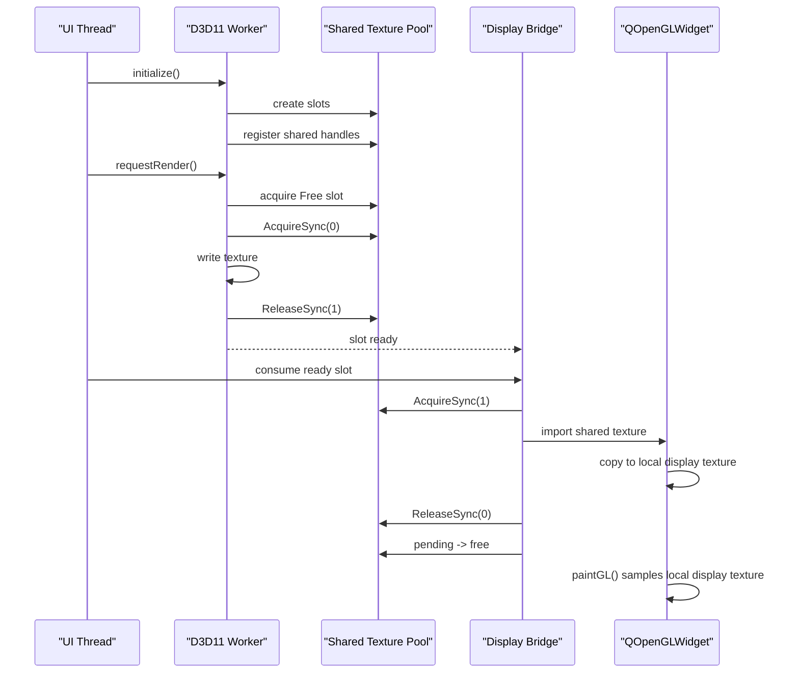

# D3D11 Native Shared Texture Design

> 状态说明
>
> 这份文档描述的是当前分支已经落地的主方案，而不是待实现的替代方案。
>
> 当前 `Qt 5.15.1 + ANGLE + GLES2 + QOpenGLWidget` 分支已经收敛到 D3D11 native shared texture 方案，默认无参主入口是 `D3D11NativeDemoWindow`。
>
> 旧的共享 `QOpenGLContext` worker 路径和阶段验证 harness 已经从主工程代码中移除。
>
> 2026-05-11 补充：
>
> - 当前实现已经进入第三阶段
> - UI 侧采用 `copy-on-acquire`
> - shared slot 在同一次 `paintGL()` 内归还
> - worker 在无 free slot 时由 slot release 事件唤醒
>
> 下文若出现 `front / retiring / frameSwapped 回收` 等表述，应视为该方案的早期阶段设计，不代表当前最终代码行为。

## 当前实现状态

截至当前分支，这条方案已经具备：

- 独立 D3D11 producer
- ANGLE/QOpenGLWidget display bridge
- keyed mutex + slot state 生命周期管理
- 真实图片目录导入、切图、resize、stress loops 的联调基础
- 单一主入口和单一构建/启动链路

## 1. 目标

把当前“worker 线程渲染 + UI 线程显示”的模型改造成：

- worker 只使用 D3D11，不再调用 GLES/ANGLE 渲染 API
- worker 直接写入 D3D11 shared texture
- UI 侧仍可保留 `QOpenGLWidget`，但只作为显示消费者
- 资源交接通过 D3D11 原生同步语义完成
- `QOpenGLWidget` 不再承担 producer/consumer 的同步正确性

这条路线的本质是：

- GL 只留在显示端
- D3D11 负责生产端
- 同步主权回到原生共享纹理

## 2. 为什么需要这条路线

当前 GLES/ANGLE 路径已经证明：

- 两个共享 `QOpenGLContext` 并发进入 ANGLE，会触发内部状态机断言
- `GLsync` / `EGLSync` 不能在当前 Qt 5.15.1 自带 ANGLE 里提供足够稳定的跨上下文同步基础
- `EGLSync` 入口在这版 ANGLE 中实际上是 `unimplemented`
- 所以继续在 GLES 层做“真并发 + 真同步”会把问题压在错误的层级上

因此，D3D11 native shared texture 方案不是优化，而是换同步域。

## 3. 非目标

本方案不做这些事：

- 不继续让 worker 线程直接执行 GLES/ANGLE 渲染
- 不依赖 `GLsync` / `EGLSync` 作为主同步机制
- 不尝试在两个 GLES 上下文之间建立无锁并发
- 不把 CPU readback 作为主路径
- 不在第一阶段追求跨平台统一

## 4. 总体架构

### 4.1 角色

- UI thread
  - 保留 `QMainWindow`、控件、事件分发
  - 保留 `QOpenGLWidget` 作为显示面

- D3D11 worker
  - 独立线程
  - 持有自己的 `ID3D11Device` / `ID3D11DeviceContext`
  - 负责计算、写纹理、提交共享句柄

- Shared texture pool
  - 管理 2~3 个 D3D11 slot
  - 每个 slot 对应一块共享纹理和一组同步对象

- Display bridge
  - 把 ready 的 D3D11 shared texture 导入 UI 显示路径
  - 只做消费，不做生产

### 4.2 数据流

1. worker 选中一个 `Free` slot
2. worker Acquire
3. worker 写入 shared texture
4. worker Release
5. display bridge 读取 ready slot
6. UI 线程显示
7. 当前第三阶段中，UI 在 local copy 完成后立即释放该 slot；后续显示只依赖 UI 本地 `display texture`

## 5. 同步模型

### 5.1 分层原则

同步分两层：

- 资源所有权同步
  - 用 D3D11 keyed mutex 或 fence
  - 保证“写完才能读、读完才能复用”

- 生命周期同步
  - 用 slot state machine
  - 保证“当前 front 不会被提前覆盖”

### 5.2 推荐基线：Keyed Mutex

优先使用 `IDXGIKeyedMutex`，原因：

- 兼容性最好
- 适合 shared texture 的 producer/consumer 交接
- 不依赖更高版本的 D3D11 fence 支持

建议 key 语义：

- `0` = worker 可写
- `1` = display 可读

当前第三阶段实现采用的基线协议：

1. worker `AcquireSync(0)`
2. worker 写纹理
3. worker `ReleaseSync(1)`
4. display 在消费 `pending` slot 的同一次 `paintGL()` 中 `AcquireSync(1)`
5. display 导入该 shared texture，并复制到 UI 本地 `display texture`
6. display 在同一次 `paintGL()` 中 `eglReleaseTexImage()` + `ReleaseSync(0)`
7. shared slot 立即回到 `Free`

### 5.3 可选升级：D3D11 Fence

如果运行时和系统版本支持：

- 可增加 `ID3D11Fence`
- 用共享 fence 做更细的 GPU 完成通知
- keyed mutex 仍保留为资源互斥底座

结论：

- keyed mutex 负责“互斥”
- fence 负责“完成”
- slot state 负责“生命周期”

## 6. Shared Texture Slot

每个 slot 建议包含：

- `ID3D11Texture2D`
- shared handle
- `IDXGIKeyedMutex`
- optional `ID3D11Fence`
- `QSize` / width / height
- `generation`
- `state`
- `lastProducedFrame`

当前第三阶段推荐状态机：

```text
Free -> Writing -> Pending -> Free
```

含义：

- `Free`
  - 可被 worker 获取
- `Writing`
  - worker 正在写
- `Pending`
  - worker 已写完，等待 display 侧消费
- 当前第三阶段中不再保留 `Displaying` / `Retiring`
- 当前显示中的内容由 UI 本地 `display texture` 承担，而不是 shared slot 本身

## 7. 显示桥接策略

### 7.1 主路径

保留 `QOpenGLWidget`，但让它只做：

- 导入 D3D11 shared texture
- 绑定成可采样的 GL 资源
- 在 `paintGL()` 中绘制

可考虑的 ANGLE 扩展路径：

- `EGL_ANGLE_d3d_share_handle_client_buffer`
- `EGL_ANGLE_d3d_texture_client_buffer`
- `EGL_ANGLE_surface_d3d_texture_2d_share_handle`

注意：

- 这里的重点是“导入共享纹理”
- 不是把 producer 重新变回 GLES

### 7.2 备选路径

如果 ANGLE import bridge 在目标环境不稳定：

- 切换到纯 D3D11 显示窗口
- 或使用 DirectComposition / SwapChain 方案

也就是说：

- `QOpenGLWidget` 只是优先方案
- 不是唯一可行方案

## 8. worker 端实现约束

worker 端必须满足：

- 不能再创建 GLES 渲染管线作为主执行路径
- 不能再依赖 `QOpenGLContext::makeCurrent()`
- 不能再依赖 `glFenceSync` / `glClientWaitSync`
- 所有算法初始化和逐帧处理都必须在 D3D11 上完成

建议 worker 设备创建参数：

- `D3D11_CREATE_DEVICE_BGRA_SUPPORT`
- 调试构建可选 `D3D11_CREATE_DEVICE_DEBUG`
- 共享纹理按需求增加 shared handle / keyed mutex 标志

## 9. 关键时序图



## 10. 风险

### 10.1 ANGLE import bridge 风险

风险点：

- 当前 Qt 自带 ANGLE 是否稳定支持 D3D11 shared handle 导入
- `QOpenGLWidget` 的内部合成路径是否对导入纹理有额外限制

应对：

- 保持 bridge 路径尽量窄，只承担 import + sample
- 如果目标环境不稳定，优先检查 Qt 实际加载的 EGL/ANGLE 运行时一致性

### 10.2 同步语义风险

风险点：

- keyed mutex 只管互斥，不自动等价于 GPU 完成
- 如果提交后没正确 flush，display 可能读到未完成内容

应对：

- worker 在 release 前显式提交命令
- 必要时在 fence 版本里增加 GPU 完成验证

### 10.3 线程所有权风险

风险点：

- D3D11 device/context 被多个线程误用
- slot state 与 mutex key 不一致

应对：

- worker 线程独占 D3D11 submit 路径
- 统一由 slot pool 管理 state

## 11. 后续工作

后续仍建议继续扩大样本并补充稳定性验证：

- 导入图片目录 100 次无崩溃
- slider 拖拽不再触发 UI 卡死
- 点击窗口最大化或 live-resize 时不再因显示侧阻塞释放而长时间无响应
- resize 过程中不闪黑、不透明丢帧
- shutdown 无资源泄漏
- slot 回收后可以再次稳定复用
- display 侧与 worker 侧不再出现任何共享 GLES 并发调用

## 12. 结论

如果目标是“在 Windows 上实现真正可靠的生产者/消费者共享纹理模型”，那么：

- producer 应该下沉到 D3D11 native texture
- consumer 可以继续是 `QOpenGLWidget`
- 同步语义应该由 keyed mutex / fence / slot state 三层共同保证
- 不应再把核心正确性压在两个 GLES 上下文的并发进入上
