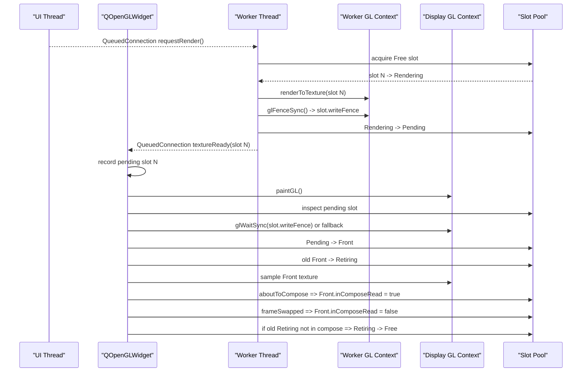

# 新的同步设计方案

> 2026-05-10 状态更新
>
> 本文档描述的是历史目标设计，不再代表当前 `Qt 5.15.1 + ANGLE + GLES2 + QOpenGLWidget` 分支上的已验证稳定实现。
>
> 当前分支在实际运行中已经证明：
>
> - 旧的双 `QOpenGLContext` / GLES 同步路线并没有成为当前主分支的最终稳定实现
> - 当前主分支已经进一步收敛到 D3D11 native shared texture 主路径
> - `QOpenGLWidget` 现在只负责通过 ANGLE/EGL import bridge 显示 shared texture，而不是与 worker 共享 GLES 渲染主路径
>
> 当前主分支已经继续前进到 standalone worker + D3D11 native shared texture + UI `copy-on-acquire` 路线。
>
> 因此本文应视为历史方案记录，而不是当前代码结构说明。

## 1. 目的

本文档定义当前项目在 `Qt 5.15.x + QOpenGLWidget + OpenGL ES 2.0/ANGLE` 路径下的新同步设计。

目标不是继续修补现有的“全局 GL 互斥锁”方案，而是把同步边界从“整个 GL 子系统串行化”收缩到“共享纹理资源交接”。

核心目标：

1. 保持 `QOpenGLWidget` 作为显示载体。
2. 保持 worker 线程负责高耗时 GPU 算法。
3. 保持输出结果仍为共享纹理，而不是 CPU readback。
4. 让高耗时 worker 渲染不再整体阻塞 UI 线程。
5. 只对真正存在读写冲突的纹理资源做同步。
6. 在 `Qt 5.15.1` 自带 ANGLE 的真实能力边界内实现。

## 2. 结论先行

当前项目的问题，不是缺一把更安全的全局锁，而是同步层级错误。

现有 `sharedGlesMutex()` 把三类问题混成了一个问题：

1. `QOpenGLWidget` 顶层窗口 compose 期间，不能和当前正在被合成的 widget texture 冲突。
2. worker 写共享纹理后，display 读取该纹理之前，必须建立可见性顺序。
3. 任意 GLES/ANGLE 访问都不能和 UI 并发。

第 1 条和第 2 条是正确约束，第 3 条是过度串行化。

新的设计要做的事，就是保留前两条，移除第三条。

## 3. 依据

### 3.1 Qt 5.15.1 的真实边界

Qt 源码明确说明：

- `QOpenGLWidget` 总是先渲染到自己的 FBO，再由顶层窗口统一 compositing。
- 如果 worker 线程直接渲染 `QOpenGLWidget` 的 framebuffer，GUI 线程在 compose 期间不能同时使用它。
- 如果不能接受 GUI 线程被 `aboutToCompose()` 阻塞，worker 必须使用 double buffering，在自己控制的额外 render target 上渲染，然后在合适时机再交给 `QOpenGLWidget`。

对应源码位置：

- [qopenglwidget.cpp](/D:/CodePrograms/Qt/5.15.1/Src/qtbase/src/widgets/kernel/qopenglwidget.cpp:297)
- [qopenglwidget.cpp](/D:/CodePrograms/Qt/5.15.1/Src/qtbase/src/widgets/kernel/qopenglwidget.cpp:309)

Qt 还实现了 `QPlatformTextureList` 的锁语义。它的粒度不是“锁整个 GL”，而是“某一组 render-to-texture widget texture 正在被 composeAndFlush 使用时，跳过本次 sync，等 unlock 后再继续”。

对应源码位置：

- [qplatformbackingstore.h](/D:/CodePrograms/Qt/5.15.1/Src/qtbase/src/gui/painting/qplatformbackingstore.h:77)
- [qwidgetrepaintmanager.cpp](/D:/CodePrograms/Qt/5.15.1/Src/qtbase/src/widgets/kernel/qwidgetrepaintmanager.cpp:73)
- [qwidgetrepaintmanager.cpp](/D:/CodePrograms/Qt/5.15.1/Src/qtbase/src/widgets/kernel/qwidgetrepaintmanager.cpp:779)

### 3.2 Chromium 的同步模型

Chromium 的材料说明了一个关键原则：同步应按语义分层。

- 单个 `GLContext` 内，不需要显式同步。
- 同一 share group 的多个驱动级上下文之间，使用 `GLFence`。
- 更高层的跨 stream / 跨进程资源流转，才需要 `SyncToken` / `GpuFence`。

对应文档：

- [chromium-gl-sync-overview.md](/D:/Desktop/AI-Agent/chromium-gpu-synchronization/docs/chromium-gl-sync-overview.md:7)
- [chromium-gl-sync-mechanisms.md](/D:/Desktop/AI-Agent/chromium-gpu-synchronization/docs/chromium-gl-sync-mechanisms.md:11)
- [chromium-sharedimage-mailbox-sync.md](/D:/Desktop/AI-Agent/chromium-gpu-synchronization/docs/chromium-sharedimage-mailbox-sync.md:120)

这和当前项目的正确抽象完全一致：

- slot identity 对应资源身份。
- per-slot fence 对应资源可见性顺序。
- slot 生命周期状态机对应资源复用顺序。

## 4. 当前实现的问题

当前实现的问题不在 `front/pending/retiring` 思路本身，而在于：

1. worker 从 `makeCurrent()` 到 `doneCurrent()` 整段持有全局递归互斥锁。
2. `QOpenGLWidget::paintEvent()` 和 `aboutToCompose()` 也争用同一把锁。
3. 一旦 worker 算法高耗时，GUI 线程所有涉及顶层窗口 OpenGL compositing 的路径都会被阻塞。

这会产生以下结果：

- slider 的值变更虽然通过 `QueuedConnection` 异步投递给 worker，但拖拽体验仍然明显卡顿。
- 卡顿不是因为 UI 同步等待 worker 返回，而是因为顶层窗口 compose 依赖 `QOpenGLWidget` 纹理，最终会被全局锁拖住。

因此：

- 当前实现是“异步提交 + 全局 GL 串行化”。
- 它不是“真正的异步共享纹理模型”。

## 5. 新设计的总体原则

新设计采用以下原则：

1. UI 线程与 worker 线程继续分离。
2. worker 永远渲染到“不在显示中的 slot”。
3. UI 线程只读取 `front slot`。
4. worker 和 UI 线程之间不再通过全局 GL 锁互斥。
5. 资源交接使用 per-slot 状态和 per-slot fence。
6. 只有“front slot 被 compose 使用”这一事实，才阻止该 slot 被复用。
7. 任何“不是 front 的 free slot”都允许 worker 继续写。

## 6. 新架构

### 6.1 角色

- `Display Context`
  - `QOpenGLWidget` 自己的 context
  - 只负责采样 `front texture` 并显示

- `Worker Context`
  - 与 display context 共享 share group
  - 只负责离屏渲染到共享 slot texture

- `Frame Slot`
  - 一张共享 `GL_TEXTURE_2D`
  - 包含状态、尺寸、版本号和同步对象

### 6.2 关键变化

旧模型：

- 全局锁保护所有 GL 操作

新模型：

- 没有全局 GL 串行锁
- 只有 slot 生命周期和 slot fence
- 只有 front slot 在 compose 窗口期被标记为“不可复用”

## 7. 资源模型

### 7.1 slot 数量

推荐保留 3 个 slot：

- `front`
- `pending`
- `free/renderable`

最低可行数量是 2，但 3 个 slot 更稳妥：

- 一个 front 正在显示
- 一个 pending 等待切换
- 一个 free 可供 worker 连续写

### 7.2 每个 slot 的元数据

每个 slot 应维护：

- `textureId`
- `size`
- `generation`
- `state`
- `writeFence`
- `inComposeRead`

建议的数据结构：

```cpp
enum class SlotState {
    Free,
    Rendering,
    Pending,
    Front,
    Retiring
};

struct SharedTextureSlot {
    GLuint textureId = 0;
    QSize size;
    quint64 generation = 0;
    SlotState state = SlotState::Free;
    GLsync writeFence = nullptr;
    bool inComposeRead = false;
};
```

说明：

- `writeFence` 表示“worker 对该 slot 的最近一次写入完成点”
- `inComposeRead` 表示“该 slot 当前正被 UI/Qt 合成路径读取，不允许复用”

## 8. 同步原语选型

### 8.1 主路径：`GLsync`

在当前 Qt 5.15.1 自带 ANGLE 里，`glFenceSync` 存在：

- [libGLESv2.cpp](/D:/CodePrograms/Qt/5.15.1/Src/qtbase/src/3rdparty/angle/src/libGLESv2/libGLESv2.cpp:1322)
- [gl3.h](/D:/CodePrograms/Qt/5.15.1/Src/qtbase/src/3rdparty/angle/include/GLES3/gl3.h:1168)

因此主路径应选择：

- worker 写完 slot 后插入 `glFenceSync`
- display context 在首次读取该 pending slot 前执行 `glWaitSync` 或保守 fallback

### 8.2 不采用 `EGLSync` 作为主路径

虽然头文件里声明了 `eglCreateSync/eglWaitSync`，但 Qt 5.15.1 自带 ANGLE 的实现源码中这条入口是 `UNIMPLEMENTED`：

- [entry_points_egl.cpp](/D:/CodePrograms/Qt/5.15.1/Src/qtbase/src/3rdparty/angle/src/libGLESv2/entry_points_egl.cpp:1014)
- [entry_points_egl.cpp](/D:/CodePrograms/Qt/5.15.1/Src/qtbase/src/3rdparty/angle/src/libGLESv2/entry_points_egl.cpp:1158)

因此：

- `EGLSync` 不应作为当前项目主实现
- 只能作为未来 ANGLE 版本升级后的候选扩展

### 8.3 fallback：`glFinish`

如果运行时探测不到可靠的 `GLsync` 能力，则 fallback 到：

- worker 端 `glFinish()`
- 然后提交 `pending`

这仍然比“整个 worker 渲染期间持有全局互斥锁”更好，因为：

- 它只让 worker 自己等待当前 slot 写完成
- 不会直接阻塞 UI 线程进入其它不冲突的路径

## 9. 新的状态机

### 9.1 状态定义

- `Free`
  - slot 可供 worker 选择

- `Rendering`
  - worker 正在写这个 slot

- `Pending`
  - worker 已完成写入，等待 UI 提升为 front

- `Front`
  - 当前显示中的 slot

- `Retiring`
  - 曾经是 front，等待确认不再被 compose 使用后回到 free

### 9.2 状态流转

```text
Free -> Rendering -> Pending -> Front -> Retiring -> Free
```

补充约束：

- 任意时刻最多一个 `Front`
- 任意时刻最多一个 `Pending`
- `Front` 不可重新进入 `Rendering`
- `Retiring` 只有在 `inComposeRead == false` 且没有人引用时才回到 `Free`

## 10. 新的时序设计

### 10.1 正常渲染流程

1. worker 从 `Free` 中挑选一个 slot。
2. 把该 slot 标记为 `Rendering`。
3. worker context 渲染到该 slot 的共享纹理。
4. worker 插入 `glFenceSync`，记录到 `slot.writeFence`。
5. 把该 slot 标记为 `Pending`。
6. 通过 `QueuedConnection` 通知 widget 有新帧。
7. widget 在自己的绘制时机尝试消费该 `Pending`。
8. display context 在首次读取该 slot 前等待 `slot.writeFence`。
9. 等待完成后，将 `Pending` 提升为 `Front`。
10. 旧 `Front` 转为 `Retiring`。
11. Qt compose 开始时，将当前 `Front` 标记 `inComposeRead = true`。
12. `frameSwapped()` 后，将旧 `Retiring` 和当前 `Front` 的 compose 标记更新。
13. 已完成退出 compose 的 `Retiring` 回到 `Free`。

### 10.2 Mermaid 时序图



## 11. `aboutToCompose` / `frameSwapped` 的新职责

旧方案中，这两个信号被用来：

- 加全局锁
- 解全局锁

新方案中，它们只负责 front slot 的生命周期标注：

- `aboutToCompose()`
  - 标记当前 `front slot` 正在被 Qt compositing 读取

- `frameSwapped()`
  - 标记本次 compose 已结束
  - 回收不再被 compose 使用的 `retiring slot`

它们不再用于阻塞 worker 整个渲染过程。

## 12. `QOpenGLWidget` 与 worker 的关系重定义

### 12.1 `QOpenGLWidget` 不再是 worker 的 render target

Qt 官方 threaded 示例里，worker 线程直接抓 `QOpenGLWidget` 自身 context 和 FBO 使用。那条路径的天然代价就是：

- `aboutToCompose()` 可以直接阻塞 GUI 线程
- 如果不阻塞，就必须自己 double buffer 再在合适时机 blit 回 widget FBO

当前项目既然已经决定“worker 输出是共享纹理”，就应该进一步明确：

- worker 的 render target 是独立共享纹理 slot
- `QOpenGLWidget` 只是 consumer
- 不再把 `QOpenGLWidget` framebuffer 当作 worker 算法真正的工作面

### 12.2 display 侧只做一件事

display 侧只做：

- 在 `paintGL()` 中采样当前 `front texture`

它不负责：

- worker 计算
- worker slot 分配
- slot 写入

## 13. 运行时能力探测

### 13.1 必须探测的内容

启动时必须记录：

- backend 是否为 `LibGLES + OpenGLES`
- 当前是否为 ANGLE 路径
- 是否解析到同一份 Qt 加载的 `libEGL/libGLESv2`
- `glFenceSync/glWaitSync/glClientWaitSync/glDeleteSync` 是否可用

### 13.2 能力分级

定义 3 档能力：

- Level A
  - `GLsync` 可用
  - 使用 per-slot GPU fence

- Level B
  - `GLsync` 不可用
  - 使用 `glFinish` 作为 worker 写完成保障

- Level C
  - 运行时仍然出现跨上下文不稳定
  - fallback 到保守模式，并明确标记“不支持低卡顿异步”

## 14. 线程安全边界

### 14.1 保留 CPU 锁，但只保护元数据

允许保留一个普通 `QMutex`，但它只保护：

- slot 状态
- generation
- pending/front/retiring 索引
- compose 标记

该锁不能包裹：

- `makeCurrent()`
- `renderToTexture()`
- `paintGL()`
- `glFinish()`
- `glWaitSync()`

也就是说：

- CPU 元数据锁可以有
- 全局 GL 临界区锁必须移除

### 14.2 slot 锁粒度

如果未来需要更细化，可进一步改为：

- pool 级元数据锁
- 每个 slot 独立原子状态

但第一阶段不必过度复杂化。

## 15. `GLsync` 的推荐使用方式

### 15.1 worker 写入完成后

worker 侧：

```cpp
if (slot.writeFence) {
    glDeleteSync(slot.writeFence);
    slot.writeFence = nullptr;
}
slot.writeFence = glFenceSync(GL_SYNC_GPU_COMMANDS_COMPLETE, 0);
glFlush();
```

说明：

- `glFenceSync` 只定义 fence 对象
- `glFlush` 让 fence 尽快进入 GPU 命令流

### 15.2 display 首次读取前

display 侧：

```cpp
if (slot.writeFence) {
    glWaitSync(slot.writeFence, 0, GL_TIMEOUT_IGNORED);
}
```

说明：

- 这里优先使用 `glWaitSync`
- 避免 UI 线程做 `glClientWaitSync` 的 CPU 阻塞
- `glWaitSync` 是 server-side wait，更接近 Chromium 所说的“建立资源可见性顺序，而不是等 GPU 全空”

### 15.3 fence 清理

slot 从 `Pending` 成为 `Front` 后，不要立刻删 fence。

建议策略：

- 在 display context 完成第一次 `glWaitSync` 后删除
- 或在 slot 重新进入 `Free` 前统一删除

要求：

- 必须保证 fence 生命周期和 slot 一起管理
- 不能泄漏

## 16. `front` 与 `retiring` 的回收规则

### 16.1 为什么还保留 `retiring`

即便不再有全局 GL 锁，`retiring` 仍然有价值。

原因：

- 顶层窗口 compose 不是 `paintGL()` 返回瞬间结束
- `frameSwapped()` 之前，旧 `front texture` 仍可能参与本轮窗口合成

因此旧 front 不能在刚被新 front 替换后就立即复用。

### 16.2 回收条件

`retiring slot` 只有满足以下条件时才能回到 `Free`：

1. 当前不是 `Front`
2. 当前不是 `Pending`
3. `inComposeRead == false`
4. display 已经完成任何必要的 fence wait

## 17. 迁移方案

### 17.1 第一阶段

目标：

- 不改动 UI 交互结构
- 仅替换同步方案

步骤：

1. 保留 `SharedTextureFramePool` 的大体状态机。
2. 删除 `gles_thread_guard.*` 的全局 GL 锁语义。
3. 在 slot 结构中加入 `GLsync writeFence`。
4. worker 写完每个 slot 后插入 fence。
5. display 在消费 pending slot 前等待该 fence。
6. `aboutToCompose/frameSwapped` 只改 slot 元数据，不再锁 GL。

### 17.2 第二阶段

目标：

- 清理旧设计残余

步骤：

1. 把 `SharedTextureFramePool` 改名为更语义化的 `SharedTextureSlotPool`。
2. 明确 `front/pending/retiring` 的 ownership。
3. 把 texture ready 通知改为只传 slot index + generation。
4. 把 display 侧对 `textureId` 的使用完全收敛到 slot 查询。

### 17.3 第三阶段

目标：

- 引入能力探测和 fallback

步骤：

1. 增加 `GLsync` runtime probe。
2. 若 `GLsync` 不可用，则自动回落到 `glFinish`。
3. 在 UI 中输出当前同步级别。

## 18. 风险

### 18.1 ANGLE/D3D11 驱动实现差异

虽然 `glFenceSync` 在 Qt 自带 ANGLE 代码中存在，但：

- 不同驱动
- 不同 debug/release 运行时
- 不同 ANGLE backend

仍可能出现行为差异。

因此必须实际验证：

- slot fence 是否稳定
- `glWaitSync` 是否会导致新的卡顿或异常

### 18.2 `QOpenGLWidget` 自身合成节拍

`QOpenGLWidget` 的顶层窗口 compositing 仍然是 UI 线程上的。

这意味着：

- UI 线程不可能完全不受渲染节拍影响
- 但只要不再被 worker 高耗时渲染整段持锁阻塞，拖拽 slider 的体感应明显改善

### 18.3 resize

resize 时必须格外谨慎：

- 只允许对当前 `Rendering` slot 重新分配纹理
- 不能触碰 `Front` 或 `Retiring` 的底层存储

否则会重现之前的黑屏或闪烁问题。

## 19. 验证计划

### 19.1 功能验证

验证项：

1. 初始启动稳定
2. 导入图片后稳定显示
3. 高频拖动 brightness slider 时，UI 不应出现明显冻结
4. resize 时无黑屏
5. 连续切图时无旧帧覆盖新帧

### 19.2 压力验证

验证项：

1. 在 worker 中注入 100ms / 200ms / 500ms 高耗时模拟
2. 验证 slider 拖动是否仍可流畅响应
3. 验证旧帧是否保持显示，而不是窗口整体卡死
4. 验证 frame pool 是否出现 slot 泄漏

### 19.3 日志验证

应记录：

- 当前 backend
- 是否开启 ANGLE D3D11 multithread protection
- `GLsync` 是否可用
- 当前 slot state 变化
- pending/front/retiring 变更
- resize 时的 slot 重分配日志

## 20. 最终建议

建议按以下优先级实施：

1. 先移除“整段 worker 渲染持有全局 GL 锁”的设计。
2. 保留现有 slot 池思路，但把同步改成 per-slot fence。
3. 让 `aboutToCompose/frameSwapped` 只表达 compose 生命周期，而不是全局互斥生命周期。
4. 先用 `GLsync` 作为主路径。
5. `EGLSync` 不进入当前主实现，因为在 Qt 5.15.1 自带 ANGLE 中该入口实现并不成立。

本项目后续的正确方向，不是“继续证明全局锁有多必要”，而是：

- 用共享纹理 slot 池表达资源身份
- 用 per-slot fence 表达资源可见性顺序
- 用 `front/pending/retiring` 表达资源生命周期顺序
- 让 worker 高耗时算法与 UI compositing 真正解耦
