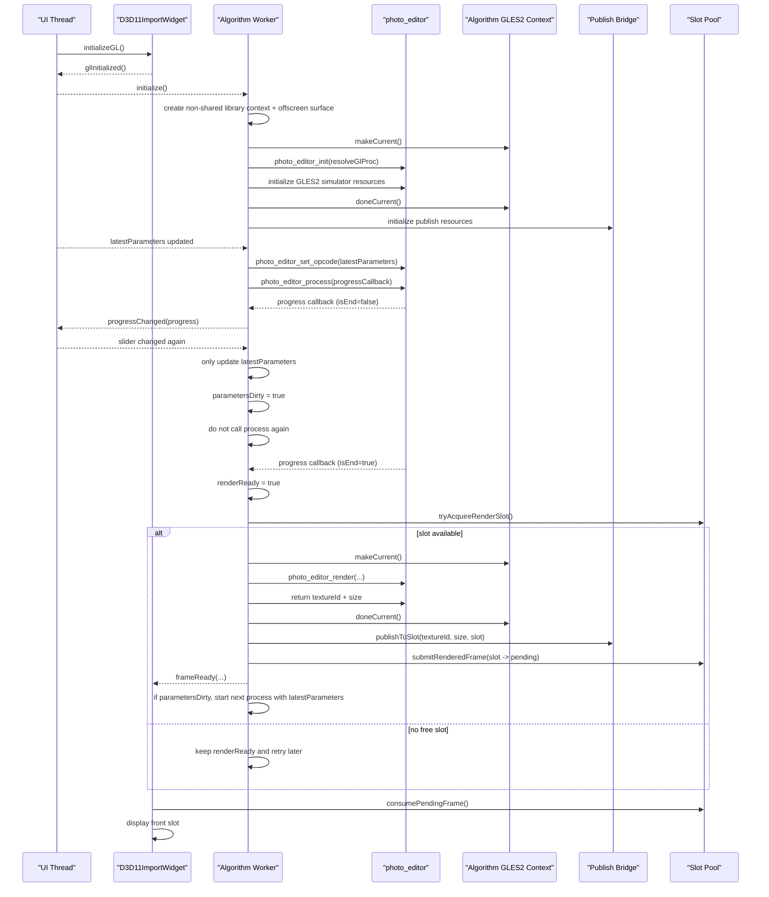

# Photo Editor 算法库接入方案

> 2026-05-10
>
> 本文档描述真实 `photo_editor_*` 算法库接入当前主工程的修改方案。
>
> 当前主工程的显示侧不变：
>
> - UI 线程继续使用 `D3D11ImportWidget`
> - UI 线程继续只消费项目自己的 shared texture
> - `D3D11NativeSlotPool` 继续管理 `free / rendering / pending / front / retiring`
>
> 当前没有现成的算法库文件和头文件，因此本文中的 `photo_editor_*` 仅是项目内模拟实现契约。
>
> 算法库侧将持有一套独立、非共享的 `QOpenGLContext + QOffscreenSurface`，并在该上下文内用 GLES2.0 完成模拟图像计算。
>
> 变化主要发生在 worker 内部的结果生成阶段和算法库上下文隔离方式。

## 1. 已确认的算法库契约

算法库调用流程如下：

1. `photo_editor_init`
2. `photo_editor_create`
3. `photo_editor_set_opcode`
4. `photo_editor_process`
5. 进度回调
6. `photo_editor_render`

其中：

- `photo_editor_init`
  - 全局只调用一次
  - 传入 GL 函数解析回调
  - 在算法库自己的非共享 context 上执行
- `photo_editor_create`
  - 为单张图片创建处理句柄
- `photo_editor_set_opcode`
  - 按功能码设置图像参数
- `photo_editor_process`
  - 发起异步处理
  - 算法库内部可多线程计算
  - 通过进度回调通知状态
  - 不要求宿主持有 GL current
- `photo_editor_render`
  - 处理完成后调用
  - 该函数要求当前线程具备算法库自己的 GL `makeCurrent` 环境
  - 该函数在库内部执行 GLES2.0 结果渲染
  - 返回的是算法库内部结果 `textureId + size`

因此需要明确：

- `photo_editor_process` 不是长时间 GL 渲染阶段
- 真正需要 GL current 的只有 `photo_editor_init`、`photo_editor_render` 以及必要的结果导出阶段
- 宿主拿到的是算法库内部结果 `textureId + size`，必须在算法库当前 context 下把它发布到项目自己的 shared texture slot

## 2. 总体设计结论

推荐方案保持当前主工程外围结构不变：

- UI 线程继续使用 `D3D11ImportWidget`
- UI 线程继续只负责显示 shared texture
- `D3D11NativeSlotPool` 继续负责 `free / rendering / pending / front / retiring`
- UI / worker 之间的跨线程资源交接继续使用 D3D11 shared texture + keyed mutex

需要变化的只有 worker 内部和算法库接入边界：

- worker 新增一套算法库专用的非共享 `QOpenGLContext + QOffscreenSurface`
- 该 context 只服务 `photo_editor_*` 和 GLES2.0 模拟计算
- worker 另外保留现有的 publish / upload bridge，用于把算法库输出的纹理拷贝到 shared texture slot
- 算法库 context 不与 `D3D11ImportWidget` 共享，也不与 publish / upload context 共享

这条路径的核心边界是：

- 算法库内部结果不直接暴露给 UI 线程
- 算法库在独立 non-shared context 中完成 GLES2.0 计算
- 宿主不把显示侧 context 共享给算法库
- 算法库结果先得到 `textureId + size`，再发布到项目自己的 shared texture slot

## 3. 线程模型

### 3.1 UI 线程职责

- 接收 slider / 按钮输入
- 显示算法进度
- 通过 `D3D11ImportWidget` 显示当前 front slot

### 3.2 Worker 线程职责

- 管理单张图片的算法 handle
- 在非共享算法库 context 上初始化 `photo_editor_*`
- 响应参数更新并调用 `photo_editor_set_opcode`
- 启动 `photo_editor_process`
- 接收进度回调并封送回 worker 自己的事件循环
- 在处理完成后切回算法库 context 执行 `photo_editor_render`
- 将算法库输出的纹理 id 和 size 交给 publish bridge
- 把结果发布到当前 slot
- 提交 `frameReady`

### 3.3 为什么不再需要全局 GL 锁

新的设计中，worker 需要区分两类 GL 区间：

1. 算法库的非共享 compute context，用于 `photo_editor_init` / `photo_editor_render`
2. 现有的 publish / upload context，用于把导出的结果写入 shared texture slot

`photo_editor_process` 期间不应持有：

- 全局 GL 互斥锁
- 长时间 `makeCurrent()`

因此 UI 卡顿不应再来自“算法处理阶段占住 GL”；真正需要串行化的只有 slot publish / display 交接。

## 4. 核心对象设计

### 4.1 `PhotoEditorLibraryHost`

职责：

- 封装 `photo_editor_init`
- 保证全局只初始化一次
- 持有算法库自己的非共享 `QOpenGLContext`
- 向算法库提供 proc resolver

建议接口：

```cpp
class PhotoEditorLibraryHost
{
public:
    bool initializeOnce(QOpenGLContext *libraryContext, QString *error);
};
```

proc resolver 规则：

```cpp
static void *resolveGlProc(const char *name)
{
    QOpenGLContext *ctx = QOpenGLContext::currentContext();
    return ctx ? reinterpret_cast<void *>(ctx->getProcAddress(name)) : nullptr;
}
```

### 4.2 `PhotoEditorSession`

职责：

- 持有单张图片处理句柄
- 管理当前参数状态
- 管理一次处理是否正在进行
- 管理处理完成后是否需要启动下一轮新处理

不引入 `requestId`。

建议状态：

```cpp
enum class SessionState {
    Idle,
    Processing,
    ReadyToRender,
    Rendering,
    Publishing,
    Failed
};
```

建议成员：

```cpp
struct PhotoEditorSession
{
    void *handle = nullptr;

    ImageEffectParameters latestParameters;
    ImageEffectParameters processingParameters;

    bool hasLatestParameters = false;
    bool parametersDirty = false;

    int latestProgress = 0;
    bool processInFlight = false;
    bool renderReady = false;
};
```

含义：

- `latestParameters`
  - UI 侧最新参数快照
- `processingParameters`
  - 当前这轮 `photo_editor_process` 实际使用的参数
- `parametersDirty`
  - 表示处理期间 UI 又改了参数
- `processInFlight`
  - 当前库内部是否仍在处理
- `renderReady`
  - 当前这轮处理已经结束，可以调用 `photo_editor_render`

### 4.3 `AngleSharedTexturePublishBridge`

职责：

- 管理 publish / upload 侧的 `QOpenGLContext + QOffscreenSurface`
- 管理把算法库输出纹理拷贝到 shared texture slot 的 copy pass
- 管理 slot 对应的 EGL / shared texture publish target

建议接口：

```cpp
class AngleSharedTexturePublishBridge
{
public:
    bool initialize(QOpenGLContext *shareContext,
                    D3D11NativeSlotPool *slotPool,
                    QString *error);

    bool publishToSlot(GLuint sourceTextureId,
                       const QSize &sourceSize,
                       int slotIndex,
                       QString *error);
};
```

### 4.4 `PhotoEditorGles2Simulator`

职责：

- 作为真实算法库的本地模拟实现
- 在独立 non-shared context 内完成 GLES2.0 图像计算
- 对外保持 `photo_editor_*` 的同一套调用节奏
- 输出 `textureId + size`

## 5. 真实调用时序

### 5.1 初始化阶段

1. `D3D11ImportWidget` 完成显示侧 `initializeGL()`
2. UI 启动 worker 线程
3. worker 创建：
   - 算法库专用的非共享 `QOpenGLContext`
   - `QOffscreenSurface`
   - `AngleSharedTexturePublishBridge`
4. worker 短时 `makeCurrent()` 到算法库 context
5. 调用 `photo_editor_init(resolveGlProc)`
6. 初始化 GLES2.0 模拟计算所需 shader / FBO / 输出资源
7. `doneCurrent()`
8. 初始化 publish bridge 所需 shader / FBO / EGL 导入资源

关键点：

- `photo_editor_init` 全局只做一次
- 不在 UI 线程初始化算法库
- 不在无 current context 时调用 `photo_editor_init`

### 5.2 单张图片会话建立

1. 导入图片
2. worker 调用 `photo_editor_create`
3. 创建 `PhotoEditorSession`
4. 把图片输入资源交给算法库

如果当前工程仍是单图预览，则只保留一个活动 session 即可。

### 5.3 参数变更策略

当前阶段不引入 `requestId`。

参数变更规则：

1. UI 修改 slider
2. UI 线程通过 `QueuedConnection` 把最新参数发给 worker
3. worker 只更新 `latestParameters`
4. 如果当前 `SessionState == Processing`，或者算法回调里还没到 `isEnd=true`
   - 只设置 `parametersDirty = true`
   - 不触发新的算法调用
5. 如果当前没有处理在进行，并且也没有待发布结果
   - 用 `latestParameters` 调用：
     - `photo_editor_set_opcode(...)`
     - `photo_editor_process(...)`
   - 同时把 `processingParameters = latestParameters`

也就是说：

- 正在 `Processing` 时，不重入调用 `photo_editor_process`
- 只保留最新参数
- 等当前这轮结束后，再决定是否启动下一轮

### 5.4 进度回调策略

进度回调可能来自算法库内部线程。

因此回调函数只做两件事：

- 更新进度值
- 把事件投递回 worker 线程

进度回调里禁止直接做：

- `makeCurrent()`
- `photo_editor_render`
- 访问 `QOpenGLWidget`
- 直接操作 slot pool

建议回调形式：

```cpp
void onProcessProgress(int progress, bool isEnd, void *userData)
{
    auto *session = static_cast<PhotoEditorSession *>(userData);
    session->postProgress(progress, isEnd);
}
```

worker 线程收到回调事件后的处理规则：

- 更新 `latestProgress`
- 如果 `isEnd == false`
  - 只更新进度显示
  - 不触发 render
- 如果 `isEnd == true`
  - `processInFlight = false`
  - `renderReady = true`
  - 调度 `tryRenderAndPublish()`

### 5.5 render + publish

这是整个方案的核心。

1. 只有当 `renderReady == true` 时，worker 才允许进入 render 阶段
2. worker 从 `slotPool->tryAcquireRenderSlot()` 获取一个 `Free` slot
3. 如果没有可用 slot
   - 保持 `renderReady = true`
   - 延迟重试
   - 不重新调用 `photo_editor_process`
4. 一旦拿到 slot：
   - worker 切回算法库 context 并 `makeCurrent()`
   - 调用 `photo_editor_render(...)`
   - 在算法库 context 内完成 GLES2.0 结果计算
   - 取得算法库输出的 `textureId + size`
   - `doneCurrent()`
   - 调用 `publishToSlot(sourceTextureId, sourceSize, slotIndex, ...)`
5. 调用 `slotPool->submitRenderedFrame(...)`
6. 发出 `frameReady(...)`
7. 发布完成后：
   - `renderReady = false`
   - 如果 `parametersDirty == true`
     - 清掉 `parametersDirty`
     - 用当前 `latestParameters` 重新执行：
       - `photo_editor_set_opcode(...)`
       - `photo_editor_process(...)`
     - 并更新 `processingParameters = latestParameters`

这里的语义是：

- 当前这轮处理先完整收口到“render + publish 完成”
- 处理期间如果 UI 又改了参数，不打断当前发布
- 当前结果发布完后，再按最新参数启动下一轮处理

## 6. 参数合并策略

本阶段只做最小化合并，不做 `requestId`。

规则只有三条：

1. 正在 `Processing` 时，新的 UI 参数只覆盖 `latestParameters`
2. `isEnd=false` 时，不触发新的算法调用
3. 当前结果 `render + publish` 完成后，如果 `parametersDirty=true`，只按最后一份 `latestParameters` 再启动一轮新处理

这意味着：

- 中间参数天然会被覆盖
- 但不需要引入显式请求编号
- 也不需要做取消协议
- 行为简单，易验证

## 7. 对当前工程的具体改造建议

### 7.1 保持不变的部分

- `D3D11ImportWidget`
- `D3D11NativeSlotPool`
- 当前 `front / pending / retiring / free` 协议
- 当前 UI 控件层
- 当前 D3D11 shared texture + keyed mutex 显示链路

### 7.2 需要替换的部分

当前 `src/d3d11_native_worker.cpp` 内部 demo D3D shader 处理链替换为：

1. `photo_editor_create`
2. `photo_editor_set_opcode`
3. `photo_editor_process`
4. 进度回调封送
5. `photo_editor_render`
6. 获取 `textureId + size`
7. `publishToSlot`

此时 `D3D11NativeWorker` 的职责变成：

- 算法会话编排
- 算法库独立 context 管理
- 本地模拟实现管理
- 参数缓存与合并
- render 时机控制
- slot 获取与提交
- 结果发布

### 7.3 新增的最小模块

建议新增：

- `src/photo_editor_library_host.h/.cpp`
- `src/photo_editor_session.h/.cpp`
- `src/photo_editor_gles2_simulator.h/.cpp`
- `src/angle_shared_texture_publish_bridge.h/.cpp`

## 8. Mermaid 时序图



## 9. 最终结论

按当前修正后的接口约束，正确方案是：

1. `photo_editor_process` 只作为异步处理阶段运行
2. `photo_editor_render` 只在算法库自己的非共享 context 上执行 GLES2.0 结果计算
3. 算法库结果以 `textureId + size` 形式输出后，再进入 D3D11 shared texture publish 流程
4. 当前阶段不引入 `requestId`
5. 如果请求仍在 `Processing`，或回调还没到 `isEnd=true`，只更新 `latestParameters`，不触发新的算法调用
6. 当 `renderReady=true` 但尚未 publish 时，新的 slider 参数继续覆盖 `latestParameters`，不打断当前发布
7. 当前结果发布完成后，如果期间参数变了，再按最后一份 `latestParameters` 启动下一轮处理
8. UI 继续沿用当前已验证的 D3D11 shared texture + ANGLE consumer 主链路
